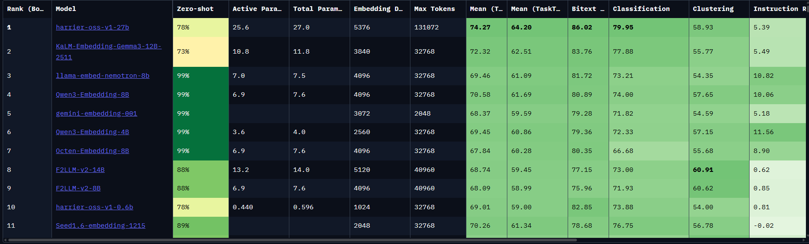

# Section 1: What Is Embedding?

In the previous chapters, we loaded documents and split them into chunks. The next step in a RAG system is to convert each chunk into a format that computers can compare efficiently.

That format is an **embedding vector**.

An embedding can be understood as a semantic coordinate. It converts text into a list of numbers:

```text
"What is RAG?"
-> [0.021, -0.183, 0.447, ...]
```

These numbers are not random. They are generated by an embedding model based on the meaning of the input. Texts with similar meanings should be close to each other in vector space, while unrelated texts should be farther apart.

In RAG, embeddings are the foundation of retrieval. Without embeddings, the system mostly relies on keyword matching. With embeddings, it can perform semantic search.

## 1. Why RAG Needs Embeddings

Suppose the knowledge base contains this sentence:

```text
RAG retrieves relevant content from an external knowledge base before passing it to the LLM for answer generation.
```

The user asks:

```text
How can a language model use my own data?
```

The two sentences do not share many exact keywords, but they are semantically related. Keyword search may miss the document, while embedding-based retrieval can understand that both are about using external knowledge to help an LLM answer.

The retrieval process can be simplified as:

```text
document chunks
-> embedding model
-> chunk vectors
-> vector database
-> query vector
-> similarity search
-> relevant chunks
```

## 2. Vector Space

An embedding model maps text into a high-dimensional vector space.

In that space:

```text
similar meanings -> closer vectors
different meanings -> farther vectors
```

For example:

```text
"What is RAG?"
"Retrieval-Augmented Generation"
"Use external knowledge to help an LLM answer"
```

These sentences should be relatively close because they describe related concepts.

In contrast:

```text
"What should I eat for dinner?"
```

should be far away from the RAG-related sentences.

The figure below illustrates the idea of high-dimensional embedding space:


Although we often draw vectors in 2D or 3D for explanation, real embedding vectors usually have hundreds or thousands of dimensions.

## 3. How Similarity Is Calculated

After text is converted into vectors, the system needs a way to compare them.

Common similarity metrics include:

| Metric | Description |
| --- | --- |
| Cosine similarity | Measures the angle between two vectors. Common for text embeddings. |
| Dot product | Measures alignment and magnitude. Often used when embeddings are normalized. |
| Euclidean distance | Measures straight-line distance between vectors. |

For RAG, cosine similarity is a common default.

When the user asks a question:

```text
query -> query vector
```

The vector database compares the query vector with stored chunk vectors and returns the most similar chunks.

## 4. Embedding in a RAG Pipeline

Embedding usually appears in two places:

```text
Ingestion time:
documents -> chunks -> embedding vectors -> vector database

Query time:
user question -> query embedding -> vector search -> retrieved chunks
```

This is why the same embedding model should usually be used for both documents and queries. If document vectors and query vectors are produced by different models, their vector spaces may not be compatible.

## 5. Common Embedding Models

Common embedding model families include:

| Model / Provider | Notes |
| --- | --- |
| BAAI/bge-m3 | Multilingual, supports dense retrieval, sparse retrieval, and multi-vector retrieval. |
| OpenAI embeddings | API-based embeddings commonly used in production systems. |
| Gemini embeddings | API-based embeddings from Google. |
| E5 / GTE / Jina embeddings | Popular open-source embedding families. |

This course often uses:

```text
BAAI/bge-m3
```

It is useful for this course because it supports multilingual retrieval and long input length. This is helpful when working with Chinese, English, and mixed course materials.

## 6. MTEB Leaderboard

When choosing an embedding model, benchmark results can be useful.

The **MTEB leaderboard** compares embedding models across different retrieval and representation tasks:

https://huggingface.co/spaces/mteb/leaderboard



Important columns include:

| Column | Meaning |
| --- | --- |
| Model | The embedding model name. |
| Embedding Dimensions | The vector dimension produced by the model. |
| Sequence Length | Maximum supported input length. |
| Active Parameters | Number of active model parameters during inference. |
| Retrieval / Classification / Clustering scores | Performance on different task categories. |

Higher embedding dimensions do not automatically mean a better model. A higher-dimensional vector can store more information, but it also increases storage, memory, and search cost.

## 7. How to Choose an Embedding Model

When choosing an embedding model for RAG, consider:

| Factor | Why It Matters |
| --- | --- |
| Language support | The model must support the language of your documents and queries. |
| Sequence length | If chunks exceed the model limit, content may be truncated. |
| Retrieval quality | The model should perform well on retrieval tasks. |
| Embedding dimensions | Higher dimensions may improve representation but increase storage cost. |
| Deployment method | Local models need compute; API models need keys, network, and cost control. |
| Domain fit | Legal, medical, code, and enterprise documents may need different models. |

For this course, `BAAI/bge-m3` is a practical default because it supports:

```text
multilingual text
longer input
dense retrieval
sparse retrieval
multi-vector retrieval
```

## 8. Key Takeaways

1. Embedding converts text into vectors.
2. Similar meanings should be close in vector space.
3. RAG uses embeddings to perform semantic retrieval.
4. The same embedding model should usually be used for documents and queries.
5. Model selection should consider language, sequence length, dimensions, retrieval quality, and deployment cost.
