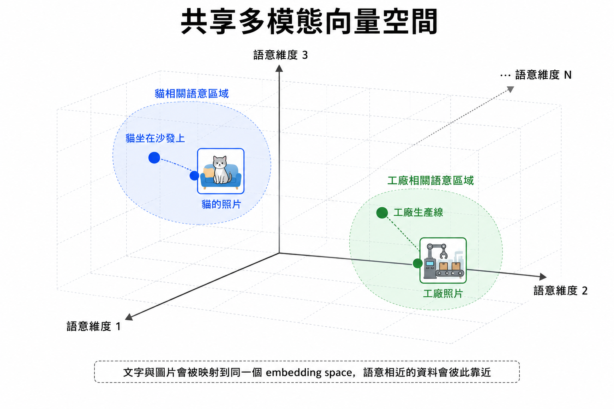
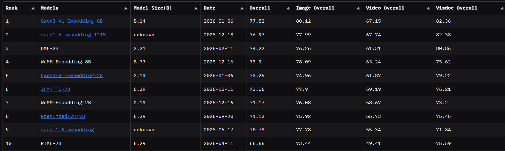

# 第二節 多模態 Embedding

[](./02_multimodal_embedding_en.md)

前一節介紹的 embedding 主要處理文字：把一段文字轉成向量，再用向量相似度找出語意接近的內容。

但真實世界的資料不只有文字。企業文件、教材、產品手冊、醫療報告、學術論文、簡報和網頁裡，經常同時包含：

```text
文字
圖片
表格
圖表
截圖
音訊
影片
```

如果 RAG 系統只能處理文字，就很難回答這類問題：

```text
這張架構圖在說明什麼？
請找出和這張產品圖相似的圖片。
這份 PDF 裡哪一頁有流程圖？
使用者上傳的圖片和哪段文件最相關？
```

這時候就需要 **多模態 Embedding（Multimodal Embedding）**。

## 一、為什麼需要多模態 Embedding

傳統文字 embedding 只能把文字放進向量空間；圖像模型則只能理解圖片。兩者如果各自使用不同的向量空間，就很難直接比較。

例如：

```text
文字：「一台紅色汽車停在路邊」
圖片：一張紅色汽車照片
```

人類知道這兩者語意相近，但如果文字向量和圖片向量不在同一個空間，就不能直接計算相似度。

多模態 embedding 的目標，就是把不同型態的資料映射到 **同一個共享向量空間**。

在這個共享空間裡：

```text
「一隻正在奔跑的狗」這段文字
```

應該會靠近：

```text
一張狗正在奔跑的圖片
```

這樣 RAG 就不只能做文字找文字，也可以做：

| 查詢方式 | 找回內容 |
| --- | --- |
| 文字查詢 | 圖片、圖文文件、文字段落 |
| 圖片查詢 | 相似圖片、相關文字說明 |
| 圖文查詢 | 同時符合圖片與文字條件的內容 |

這種能力也稱為 **跨模態檢索（Cross-modal Retrieval）**。

## 二、共享向量空間

多模態 embedding 最核心的概念是 **對齊（Alignment）**。

模型要學會把語意相近的不同模態資料放近一點，把語意不相關的資料推遠一點。

可以想像成：



在這個空間中，重點不是資料原本是文字還是圖片，而是它們表達的語意是否接近。

對 RAG 來說，這代表我們可以把文字 chunk、圖片、圖表截圖、頁面截圖都轉成向量，再放進 vector store 做檢索。

## 三、CLIP：圖文 Embedding 的代表模型


在圖文多模態領域，OpenAI 的 **CLIP（Contrastive Language-Image Pre-training）** 是很重要的代表模型。

CLIP 的核心想法是把圖片與文字放進同一個向量空間：

```text
圖片 encoder：把圖片轉成 image embedding
文字 encoder：把文字轉成 text embedding
```

只要圖片和文字語意相符，它們的向量就應該接近；如果語意不相關，向量距離就會比較遠。

| 元件 | 功能 |
| --- | --- |
| Image Encoder | 讀取圖片，輸出圖片向量 |
| Text Encoder | 讀取文字，輸出文字向量 |
| Similarity Function | 比較圖片向量與文字向量是否接近 |

CLIP 能做到圖文對齊，關鍵在於 **對比學習（Contrastive Learning）**。訓練時，模型會看到大量圖片與文字配對：

```text
圖片 A <-> 文字 A
圖片 B <-> 文字 B
圖片 C <-> 文字 C
```

模型的目標是：

1. 讓正確配對的圖片和文字向量更接近。
2. 讓錯誤配對的圖片和文字向量更遠。

在 RAG 中，這個能力可以用來做文字搜尋圖片、圖片搜尋文字，或把圖片與文字資料放進同一個檢索流程。

## 四、多模態 Embedding 在 RAG 中怎麼用

文字 RAG 的資料單位通常是 chunk；多模態 RAG 的資料單位可能更多元。

常見做法有三種。

### 4.1 圖片直接 Embedding

如果資料本身包含圖片，例如產品照片、醫療影像、設計稿、截圖，可以直接用多模態 embedding model 把圖片轉成向量。

```text
圖片 -> image embedding -> vector store
```

查詢時，使用者可以用文字搜尋圖片：

```text
「找出有紅色汽車的圖片」
```

系統會把這句話轉成 text embedding，再和圖片 embedding 做相似度搜尋。

### 4.2 圖片轉文字後再 Embedding

另一種常見做法是先把圖片轉成文字描述，再用文字 embedding。

```text
圖片 -> caption / OCR / layout parsing -> 文字 -> text embedding
```

這種方法實作簡單，適合：

1. 圖片主要是文字截圖。
2. 圖表可以用文字摘要描述。
3. 目前系統只支援文字向量資料庫。

但缺點是圖片細節可能會在 caption 或 OCR 階段流失。

### 4.3 圖文聯合 Embedding

有些模型可以同時接收圖片與文字，產生更完整的多模態表示。

```text
圖片 + 文字描述 -> multimodal embedding
```

這適合資料本身就是圖文混合的情境，例如：

```text
商品圖片 + 商品描述
論文圖表 + 圖說
網頁截圖 + 頁面標題
簡報圖片 + 投影片文字
```

這種方式比單純圖片或單純文字更能保留完整上下文。

## 五、常見多模態 Embedding 模型



如果想比較多模態 embedding model，可以參考 Hugging Face 上的 [MMEB Leaderboard](https://huggingface.co/spaces/TIGER-Lab/MMEB-Leaderboard)。MMEB 主要用來評估模型在多模態任務上的表現，例如圖文檢索、跨模態理解與多模態 retrieval。

Leaderboard 可以用來篩選候選模型，但實務上仍要用自己的資料測試。特別是中文資料、專業領域文件、圖表、截圖與 PDF 頁面，排行榜分數高不代表一定最適合你的 RAG 任務。

### 5.1 Visualized-BGE / bge-visualized-m3

`bge-visualized-m3` 是 BAAI 提供的 Visualized-BGE 系列模型之一。

它的設計重點是把圖片能力整合進 BGE text embedding 框架，讓模型能處理文字、圖片，以及圖文混合資料。

`bge-visualized-m3` 繼承 `BAAI/bge-m3` 的一些重要特性：

| 特性 | 說明 |
| --- | --- |
| Multi-Linguality | 支援多語言文字表示，適合中英文混合資料 |
| Multi-Functionality | 可支援不同檢索需求，例如 dense retrieval、multi-vector retrieval |
| Multi-Granularity | 文字側可處理短句到較長文件 |

對本課程來說，`bge-visualized-m3` 很適合用來理解「文字 embedding 如何擴展到圖文 embedding」。

### 5.2 Gemini-embedding-2

`gemini-embedding-2` 是 Gemini API 的多模態 embedding model，可以把文字、圖片、音訊、影片與 PDF 文件映射到同一個 embedding space。

這代表它不只可以做「文字找文字」，也可以做跨模態檢索：

| 查詢 | 候選資料 | 例子 |
| --- | --- | --- |
| 文字 | 圖片 | 用「RAG 流程圖」搜尋相關圖片 |
| 文字 | PDF 頁面 | 找出文件中和問題最相關的頁面 |
| 圖片 | 文字 | 用一張截圖找相關說明段落 |
| 圖文 | 圖文 | 用圖片加文字條件找相似資料 |

`gemini-embedding-2` 支援的輸入模態包含：

| 模態 | 說明 |
| --- | --- |
| Text | 可處理文字內容，適合一般 RAG chunk |
| Image | 可處理 PNG、JPEG 圖片 |
| Audio | 可處理音訊片段 |
| Video | 可處理影片片段 |
| PDF | 可直接處理 PDF 頁面內容 |

在 RAG 中，`gemini-embedding-2` 可以用兩種方式使用：

1. **直接多模態 embedding**：把圖片、PDF、音訊或影片直接轉成向量。
2. **搭配 OCR / caption / layout parsing**：先抽出文字、圖說、附近段落，再和原始圖片一起建立更完整的索引。

`gemini-embedding-2` 不使用 `task_type` 參數。若要針對 retrieval 最佳化，官方建議把任務寫進輸入文字中，例如：

```text
查詢：task: search result | query: 哪張圖片在說明 RAG 的檢索流程？
文件：title: RAG 架構圖 | text: 這張圖片展示 RAG 系統流程...
```

這種方式可以讓模型知道目前是在做搜尋、問答、事實查核或程式碼檢索。

## 六、程式概念示例

以下範例使用 `gemini-embedding-2` 示範「文字查詢搜尋圖片」的流程。

這裡假設資料夾中有兩張圖片：

```text
images/rag_architecture.png
images/dinner.png
```

程式會把使用者問題和圖片都轉成 embedding，然後用 cosine similarity 找出最相關的圖片。

```python
from pathlib import Path

from google import genai
from google.genai import types
from sklearn.metrics.pairwise import cosine_similarity

client = genai.Client()

image_items = [
    {"title": "RAG 架構圖", "path": IMAGE_DIR / "02_rag_architecture.png"},
    {"title": "AI Agent 圖片", "path": IMAGE_DIR / "02_ai_agent.jpg"},
]

query = "哪張圖片在說明 RAG 的檢索流程？"

contents = [
    types.Content(
        parts=[
            types.Part.from_text(
                text=f"task: search result | query: {query}"
            )
        ]
    )
]

for item in image_items:
    image_bytes = item["path"].read_bytes()
    contents.append(
        types.Content(
            parts=[
                types.Part.from_bytes(
                    data=image_bytes,
                    mime_type="image/png",
                )
            ]
        )
    )

result = client.models.embed_content(
    model="gemini-embedding-2",
    contents=contents,
    config=types.EmbedContentConfig(output_dimensionality=768),
)

vectors = [embedding.values for embedding in result.embeddings]
query_vector = [vectors[0]]
image_vectors = vectors[1:]

scores = cosine_similarity(query_vector, image_vectors)[0]

for item, score in sorted(
    zip(image_items, scores),
    key=lambda item: item[1],
    reverse=True,
):
    print(f"{item['title']}: {score:.4f}")
```

### 6.1 重要參數

| 參數 | 說明 |
| --- | --- |
| `model` | 指定 embedding model，這裡使用 `"gemini-embedding-2"` |
| `contents` | 要轉成 embedding 的內容，可以包含文字、圖片、音訊、影片或 PDF |
| `types.Content` | 表示一筆獨立輸入；多筆 `Content` 會分別產生多個 embeddings |
| `types.Part.from_text()` | 建立文字輸入 |
| `types.Part.from_bytes()` | 建立圖片、音訊、影片或 PDF 等 binary 輸入 |
| `mime_type` | 指定檔案格式，例如 `"image/png"`、`"image/jpeg"`、`"application/pdf"` |
| `output_dimensionality` | 控制輸出向量維度，較小維度可降低儲存與搜尋成本 |

### 6.2 `contents`

`contents` 決定模型會如何產生 embedding。

如果把多個 parts 放在同一筆輸入中，模型會產生一個整體 embedding：

```python
result = client.models.embed_content(
    model="gemini-embedding-2",
    contents=[
        "一張 RAG 架構圖",
        types.Part.from_bytes(
            data=image_bytes,
            mime_type="image/png",
        ),
    ],
)
```

這適合「圖片 + 文字說明」要被視為同一筆資料的情境。

如果要讓每張圖片各自有自己的 embedding，就要使用多個 `types.Content`：

```python
contents = [
    types.Content(parts=[types.Part.from_text(text="task: search result | query: RAG 流程圖")]),
    types.Content(parts=[types.Part.from_bytes(data=image_1, mime_type="image/png")]),
    types.Content(parts=[types.Part.from_bytes(data=image_2, mime_type="image/png")]),
]
```

這樣回傳結果會包含三個 embeddings：一個 query embedding、兩個 image embeddings。

### 6.3 Task instruction

對文字 retrieval 任務，可以把任務寫進文字裡：

```python
query_text = f"task: search result | query: {query}"
```

如果是文件文字，可以使用：

```python
document_text = f"title: {title} | text: {content}"
```

這種格式可以讓模型知道這段文字是「查詢」還是「要被搜尋的文件」。

### 6.4 `output_dimensionality`

`gemini-embedding-2` 預設會輸出較高維度的向量。透過 `output_dimensionality`，可以控制輸出向量大小。

例如：

```python
config=types.EmbedContentConfig(
    output_dimensionality=768,
)
```

維度較小時，vector store 的儲存空間與搜尋成本會降低；維度較高時，通常可以保留更多語意資訊。實務上可以依資料量、成本與檢索效果測試選擇。

### 6.5 文字、圖片與 PDF 都可以進同一個空間

`gemini-embedding-2` 可以把不同模態資料映射到同一個 embedding space。

例如 PDF 可以直接用 bytes 輸入：

```python
pdf_bytes = Path("report.pdf").read_bytes()

result = client.models.embed_content(
    model="gemini-embedding-2",
    contents=[
        types.Part.from_bytes(
            data=pdf_bytes,
            mime_type="application/pdf",
        )
    ],
    config=types.EmbedContentConfig(
        output_dimensionality=768,
    ),
)
```

實務上仍建議保留 OCR、caption、頁碼、圖片路徑和附近文字，因為 retrieval 找到向量後，LLM 還需要完整上下文才能回答得清楚。

## 七、多模態 RAG 的資料處理策略

建立多模態 RAG 時，資料處理通常比純文字 RAG 更複雜。

### 7.1 保留圖片與文字的關係

如果一張圖片出現在 PDF 第 5 頁，旁邊有圖說與段落說明，metadata 應該保留這些關係：

```text
source: report.pdf
page: 5
type: image
caption: 圖 3：RAG 系統架構
nearby_text: 本節說明 retrieval、reranking 和 generation 的流程。
```

這樣 retrieval 找到圖片時，LLM 才能取得足夠上下文。

### 7.2 圖片要不要切分

文字有 chunking，圖片也可能需要切分。

例如一張複雜流程圖可能包含多個區塊：

```text
資料載入區
Embedding 區
Vector Store 區
LLM 回答區
```

如果整張圖直接 embedding，可能會太粗略。可以考慮把圖片切成區塊，或搭配 OCR / layout parser 取得局部資訊。

### 7.3 Vector Store 要存什麼

多模態 RAG 不只要存向量，也要存原始資料位置。

| 欄位 | 說明 |
| --- | --- |
| `embedding` | 圖片、文字或圖文資料的向量 |
| `modality` | 資料型態，例如 text、image、image_text |
| `source` | 原始檔案來源 |
| `page` | PDF 頁碼或投影片頁數 |
| `image_path` | 圖片檔案位置 |
| `caption` | 圖片說明或模型產生的描述 |
| `nearby_text` | 圖片附近的文字內容 |

如果 metadata 沒有設計好，即使 retrieval 找到正確圖片，後續也很難把圖片與原文件脈絡接起來。

## 八、多模態 Embedding 的限制

多模態 embedding 很有用，但也有一些限制。

| 限制 | 說明 |
| --- | --- |
| 圖片細節可能遺失 | 小字、密集表格、複雜公式不一定能被完整表示 |
| 中文能力不一定穩定 | 有些模型主要以英文圖文資料訓練 |
| 向量相似不等於事實正確 | 找到相似圖片不代表內容一定能直接回答問題 |
| 成本較高 | 圖片模型通常比純文字 embedding 更耗資源 |
| metadata 更重要 | 圖片需要頁碼、圖說、附近文字才能形成完整上下文 |

因此在實務上，多模態 RAG 常會搭配：

1. OCR。
2. Layout parsing。
3. Image captioning。
4. Multimodal embedding。
5. Reranking。

多模態 embedding 負責幫系統找到可能相關的圖片或圖文資料，但最後要讓 LLM 回答得好，仍然需要完整的上下文整理。

## 九、本節重點整理

1. 多模態 embedding 會把文字、圖片等不同資料型態映射到共享向量空間。
2. 跨模態對齊讓文字可以搜尋圖片，圖片也可以搜尋文字。
3. CLIP 使用雙編碼器架構與對比學習，是圖文 embedding 的代表模型。
4. 多模態 RAG 可以處理圖片、截圖、圖表、PDF 頁面與圖文混合資料。
5. `bge-visualized-m3` 展示了如何把 BGE 文字 embedding 擴展到多模態檢索。
6. `gemini-embedding-2` 是 Gemini API 的多模態 embedding model，可把文字、圖片、音訊、影片與 PDF 放進同一個向量空間。
7. 多模態資料一定要設計好 metadata，尤其是圖片來源、頁碼、圖說與附近文字。
8. 多模態 embedding 不是 OCR 或 captioning 的替代品，實務上常需要搭配使用。

## 十、練習

可以嘗試思考以下問題：

1. 如果一份 PDF 有很多流程圖，你會直接對整頁做 embedding，還是先切出圖片區塊？
2. 如果使用者用文字搜尋圖片，你會只存 image embedding，還是同時存 caption embedding？
3. 對產品手冊來說，圖片 metadata 應該包含哪些欄位？
4. 如果圖片裡有大量文字，應該優先使用 OCR、image embedding，還是兩者都用？

## 參考資料

- [Datawhale all-in-rag：多模態嵌入](https://github.com/datawhalechina/all-in-rag/blob/main/docs/chapter3/07_multimodal_embedding.md)
- [Hugging Face MMEB Leaderboard](https://huggingface.co/spaces/TIGER-Lab/MMEB-Leaderboard)
- [BAAI Visualized-BGE Model Card](https://huggingface.co/BAAI/bge-visualized)
- [BAAI/bge-m3 Model Card](https://huggingface.co/BAAI/bge-m3)
- [Gemini API Embeddings](https://ai.google.dev/gemini-api/docs/embeddings)
