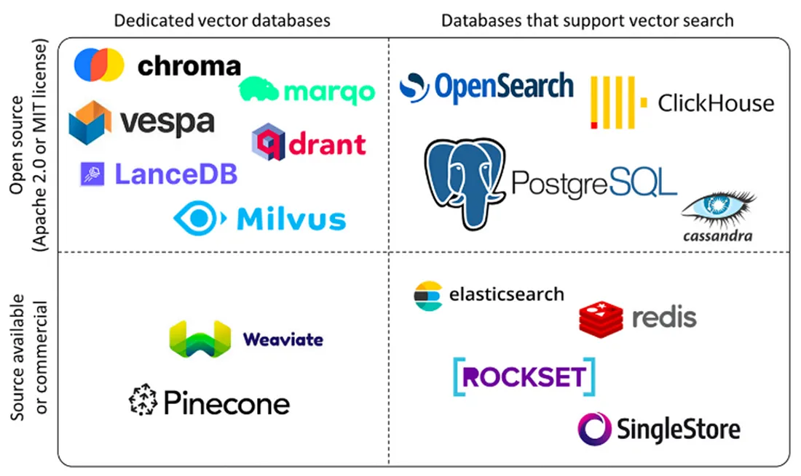

# 第三節 向量資料庫

前兩節介紹了 embedding 與多模態 embedding。Embedding model 會把文字、圖片或文件轉成向量，但光有向量還不夠。

RAG 系統還需要一個地方保存這些向量，並且在使用者提問時，快速找出最相似的資料。

這個地方就是 **向量資料庫（Vector Database）**。

在 RAG 裡，向量資料庫通常負責：

```text
儲存 chunk / 圖片 / 文件頁面
儲存 embedding vector
儲存 metadata
根據 query vector 做相似度搜尋
回傳最相關的資料給 LLM
```

可以把它想成 RAG 的「語意搜尋引擎」。

## 一、為什麼需要向量資料庫

假設你只有 10 個 chunks，要找出最相似的資料，可以直接逐一計算相似度。

但真實 RAG 專案通常不是 10 筆資料，而可能是：

```text
1,000 個 chunks
100,000 個 chunks
10,000,000 個 chunks
甚至更多
```

如果每次查詢都把 query vector 和所有向量逐一比對，速度會非常慢。

向量資料庫的價值就在這裡：它會使用特殊的索引結構，讓系統可以在大量高維向量中快速找到最接近的資料。

RAG 查詢時大致會變成：

```text
使用者問題
-> embedding model
-> query vector
-> vector database
-> top-k relevant chunks
-> LLM 生成答案
```

## 二、向量資料庫會存什麼

一筆向量資料通常不只是一個 vector。

實務上，它通常會包含：

| 欄位 | 說明 |
| --- | --- |
| `id` | 每筆資料的唯一識別碼 |
| `embedding` | embedding model 產生的向量 |
| `content` | 原始文字、圖片描述、OCR 結果或 chunk 內容 |
| `metadata` | 來源、頁碼、檔名、資料型態、時間等補充資訊 |

例如一筆 RAG chunk 可以長這樣：

```python
{
    "id": "rag_intro_page_3_chunk_2",
    "embedding": [0.021, -0.183, 0.447, "..."],
    "content": "RAG 會先從外部知識庫找出相關內容，再交給 LLM 生成答案。",
    "metadata": {
        "source": "what-is-rag.pdf",
        "page": 3,
        "chapter": "01_what_is_RAG",
        "modality": "text",
        "chunk_index": 2,
    },
}
```

多模態資料也可以一起存 metadata：

```python
{
    "id": "report_page_5_image_1",
    "embedding": [0.011, 0.392, -0.078, "..."],
    "content": "RAG 系統架構圖，包含 Data Loading、Chunking、Embedding、Vector Store。",
    "metadata": {
        "source": "rag_report.pdf",
        "page": 5,
        "modality": "image",
        "image_path": "images/report_page_5_image_1.png",
        "caption": "圖 2：RAG 系統架構",
        "nearby_text": "本節說明 RAG 如何從文件中找回相關內容。",
    },
}
```

向量負責「找相似」，metadata 負責「接回原始脈絡」。

如果 metadata 設計不好，即使檢索找到了正確 chunk，也可能不知道它來自哪個檔案、第幾頁、哪張圖片，後續很難引用來源或回到原始資料。

## 三、向量資料庫 vs 傳統資料庫

傳統資料庫，例如 MySQL、PostgreSQL，擅長處理結構化資料與精確查詢。

例如：

```sql
SELECT * FROM users WHERE age = 25;
```

這種查詢很明確：找出 `age` 等於 `25` 的資料。

但 RAG 常見問題不是精確查詢，而是語意查詢：

```text
「大型語言模型要怎麼引用自己的資料？」
```

它可能需要找回：

```text
「RAG 會從外部知識庫檢索相關內容，再交給 LLM 回答。」
```

這兩句字面不同，但語意接近。傳統資料庫不擅長處理這種高維向量相似度搜尋。

| 面向 | 向量資料庫 | 傳統資料庫 |
| --- | --- | --- |
| 核心資料 | Embedding vectors、metadata、原始內容 | 表格、欄位、關聯資料 |
| 查詢方式 | 相似度搜尋、Top-K retrieval | 精確查詢、範圍查詢、Join |
| 常見索引 | HNSW、IVF、PQ、LSH | B-Tree、Hash index |
| 適合場景 | RAG、推薦系統、語意搜尋、圖片搜尋 | 交易系統、會員資料、訂單管理 |
| 查詢目標 | 找「語意最接近」的資料 | 找「條件完全符合」的資料 |
| 一致性需求 | 常見為最終一致性或近即時更新 | 常見為 ACID 強一致性 |

兩者不是互相取代，而是互補。

實務上常見架構是：

```text
傳統資料庫：存使用者、訂單、權限、結構化 metadata
向量資料庫：存 embedding vectors，負責語意檢索
Object Storage：存 PDF、圖片、音訊、影片等原始檔
```

## 四、向量資料庫的工作原理

向量資料庫的核心任務是：在大量向量中找出和 query vector 最接近的 Top-K 筆資料。

最直覺的方法是暴力搜尋：

```text
query vector vs vector 1
query vector vs vector 2
query vector vs vector 3
...
query vector vs vector N
```

這種方法稱為 brute-force search。資料量小時可以接受，但資料量大時成本很高。

因此向量資料庫通常會使用 **ANN（Approximate Nearest Neighbor，近似最近鄰）**。

ANN 的重點是：

```text
不一定保證找到理論上 100% 最相似的向量
但能在速度和準確率之間取得平衡
```

在 RAG 裡，這通常是可以接受的，因為 retrieval 後面還可以搭配 reranker、metadata filter、LLM 判斷來提升品質。

## 五、常見索引方法

### 5.1 HNSW

HNSW 是目前非常常見的向量索引方法，全名是 Hierarchical Navigable Small World。

它會把向量建立成多層圖結構。查詢時，系統會從上層較粗略的圖開始找，再逐步往下層精細搜尋。

可以想成：

```text
先快速找到大概區域
再在附近找更接近的向量
```

HNSW 的優點是查詢速度快、效果穩定，很多向量資料庫都支援它。

### 5.2 IVF

IVF 是 Inverted File Index 的縮寫。

它會先把向量分成多個群集。查詢時，不需要搜尋所有向量，只要先找到 query vector 最接近的幾個群集，再在這些群集裡搜尋。

適合資料量較大、希望降低搜尋範圍的情境。

### 5.3 PQ

PQ 是 Product Quantization。

它會把高維向量壓縮成較小的表示，降低記憶體和儲存成本。

優點是省空間；缺點是壓縮後可能犧牲部分檢索精度。

### 5.4 LSH

LSH 是 Locality Sensitive Hashing。

它會使用特殊 hash function，讓相似向量更可能落在同一個 bucket 中。

LSH 的概念容易理解，但在現代 RAG 向量資料庫中，HNSW 和 IVF 類方法更常見。

## 六、相似度與距離

向量資料庫搜尋時，通常會依照某種距離或相似度排序。

常見方法包括：

| 方法 | 說明 |
| --- | --- |
| Cosine similarity | 比較向量方向是否接近 |
| Dot product | 計算向量內積，常搭配 normalized embeddings |
| Euclidean distance | 計算向量之間的直線距離 |

使用哪一種距離，要和 embedding model 的訓練方式、向量是否正規化、vector store 設定保持一致。

例如本課程前面使用：

```python
encode_kwargs={"normalize_embeddings": True}
```

代表輸出的向量會被正規化。這種情況下，dot product 和 cosine similarity 的效果通常會比較接近。

## 七、Metadata Filter

向量資料庫不只做相似度搜尋，也常搭配 metadata filter。

例如：

```text
找出和「embedding model 怎麼選」最相關的 chunks
但只搜尋 chapter = "03_embedding" 的資料
```

或：

```text
找出和「RAG 架構圖」相關的內容
但只搜尋 modality = "image" 的資料
```

這種查詢通常會同時使用：

```text
vector similarity search
+ metadata filter
```

metadata filter 對多模態 RAG 特別重要，因為你可能需要限制資料型態：

| 查詢需求 | metadata filter |
| --- | --- |
| 只找圖片 | `modality = "image"` |
| 只找 PDF 第 5 頁 | `source = "xxx.pdf"` 且 `page = 5` |
| 只找某個章節 | `chapter = "03_embedding"` |
| 只找 2026 年後文件 | `created_at >= "2026-01-01"` |

## 八、主流向量資料庫與工具



這張圖整理了常見向量資料庫與工具，方便快速比較各自適合的使用情境。

### 8.1 FAISS

FAISS 是 Meta AI 開源的向量搜尋工具，適合本地向量索引、實驗與中小型原型。

它本質上比較像「向量搜尋函式庫」，不是完整資料庫服務。

適合：

1. 教學示範。
2. 本地開發。
3. 快速驗證 RAG retrieval 流程。
4. 不想額外啟動資料庫服務的情境。

### 8.2 Chroma

Chroma 是輕量級 vector database，常用在 LangChain / LlamaIndex 原型開發。

它的優點是簡單、容易上手，可以本地持久化資料。

適合：

1. 個人專案。
2. 教學課程。
3. 小型 RAG prototype。

### 8.3 Milvus

Milvus 是開源分散式向量資料庫，適合大規模向量檢索與生產部署。

適合：

1. 百萬到億級向量。
2. 高效能檢索。
3. 需要分散式部署的企業場景。

### 8.4 Qdrant

Qdrant 是以 Rust 開發的向量資料庫，重視效能與 metadata filter。

適合：

1. 需要高效 metadata filtering 的 RAG 系統。
2. 中小型到生產級部署。
3. 希望用開源服務但不想架太複雜的系統。

### 8.5 Weaviate

Weaviate 是 AI-native vector database，支援 GraphQL API、模組化架構與多模態資料。

適合：

1. 多模態搜尋。
2. 快速整合 AI 模型。
3. 需要 schema 與 metadata 管理的應用。

### 8.6 Pinecone

Pinecone 是雲端託管向量資料庫，特色是不用自己維運基礎設施。

適合：

1. 企業級生產環境。
2. 希望降低維運成本。
3. 需要高可用、擴展性與穩定 SLA 的場景。

### 8.7 選型建議

| 情境 | 建議 |
| --- | --- |
| 剛學 RAG | `InMemoryVectorStore`、FAISS、Chroma |
| 本地 prototype | FAISS、Chroma |
| 需要 metadata filter | Qdrant、Milvus、Weaviate |
| 大規模開源部署 | Milvus、Qdrant |
| 不想維運資料庫 | Pinecone |
| 多模態資料管理 | Weaviate、Milvus、Qdrant |

本課程前面使用 `InMemoryVectorStore`，是為了讓 RAG 流程最容易理解。正式專案通常會改成 FAISS、Chroma、Qdrant、Milvus、Weaviate 或 Pinecone。

## 九、本地向量儲存：以 FAISS 為例

FAISS 適合用來理解向量資料庫的基本流程：

```text
準備 documents
-> 建立 embedding model
-> 建立 FAISS vector store
-> 儲存到本地
-> 重新載入
-> similarity search
```

### 9.1 基礎範例

以下範例示範如何用 LangChain 讀取本章 Markdown 檔案，切成 chunks，建立 FAISS index，並把資料保存到本地。

```python
from pathlib import Path

from langchain_community.document_loaders import TextLoader
from langchain_community.vectorstores import FAISS
from langchain_huggingface import HuggingFaceEmbeddings
from langchain_text_splitters import RecursiveCharacterTextSplitter


PROJECT_ROOT = Path(__file__).resolve().parents[2]
CHAPTER_DIR = PROJECT_ROOT / "chapter" / "03_embedding"
FAISS_PATH = PROJECT_ROOT / "data" / "C3" / "faiss_index"

markdown_paths = [
    CHAPTER_DIR / "01_what_is_embedding.md",
    CHAPTER_DIR / "02_multimodal_embedding.md",
    CHAPTER_DIR / "03_vector_db.md",
]

docs = []
for markdown_path in markdown_paths:
    loader = TextLoader(str(markdown_path), encoding="utf-8")
    loaded_docs = loader.load()

    for doc in loaded_docs:
        doc.metadata.update(
            {
                "source": str(markdown_path.relative_to(PROJECT_ROOT)),
                "chapter": "03_embedding",
                "modality": "text",
            }
        )

    docs.extend(loaded_docs)

text_splitter = RecursiveCharacterTextSplitter(
    chunk_size=500,
    chunk_overlap=50,
    separators=[
        "\n## ",
        "\n### ",
        "\n\n",
        "\n",
        "。",
        "，",
        " ",
        "",
    ],
)

chunks = text_splitter.split_documents(docs)

embeddings = HuggingFaceEmbeddings(
    model_name="BAAI/bge-m3",
    model_kwargs={"device": "cpu"},
    encode_kwargs={"normalize_embeddings": True},
)

FAISS_PATH.parent.mkdir(parents=True, exist_ok=True)

vectorstore = FAISS.from_documents(chunks, embeddings)
vectorstore.save_local(str(FAISS_PATH))

print(f"已載入 {len(docs)} 份 Markdown 文件")
print(f"已切成 {len(chunks)} 個 chunks")
print(f"FAISS index 已儲存到：{FAISS_PATH}")
```

每個 chunk 都會保留 metadata，例如：

```python
{
    "source": "chapter/03_embedding/01_what_is_embedding.md",
    "chapter": "03_embedding",
    "modality": "text",
}
```

#### 重新載入並查詢

FAISS 儲存後，之後可以重新載入：

```python
loaded_vectorstore = FAISS.load_local(
    str(FAISS_PATH),
    embeddings,
    allow_dangerous_deserialization=True,
)

query = "RAG 為什麼需要向量資料庫？"
results = loaded_vectorstore.similarity_search(query, k=2)

for doc in results:
    print(doc.page_content)
    print(doc.metadata)
```

`similarity_search(query, k=2)` 代表找回最相似的 2 筆文件。

回傳的 `doc` 會包含：

```text
doc.page_content
doc.metadata
```

所以 metadata 會跟著 retrieval 結果一起回來。

#### `allow_dangerous_deserialization=True`

使用 `FAISS.load_local()` 時，LangChain 需要載入本地儲存的 docstore 資料。這個資料通常會透過 pickle 反序列化。

這個參數的意思是：你允許程式載入本地 pickle 檔案。

安全上要注意：

```text
只載入你自己建立或信任來源的 FAISS index
不要載入陌生人提供的 pickle / FAISS index
```

### 9.2 LlamaIndex 版本補充

除了 LangChain + FAISS，本課程也提供一個 LlamaIndex 版本範例：

```python
# chapter/03_embedding/03_llamaindex_vector.py
```

這個範例同樣讀取本章 Markdown 檔案，使用 BAAI/bge-m3 建立 embeddings，接著建立 VectorStoreIndex 並持久化到本地。

和 LangChain 版相比，LlamaIndex 把文件讀取、node 切分、index 建立與查詢流程包裝得更高階，適合想快速建立 query engine 的情境。


## 十、FAISS 內部大概做了什麼

當你呼叫：

```python
vectorstore = FAISS.from_documents(docs, embeddings)
```

背後大致會做幾件事：

1. 從 `Document` 取出 `page_content`。
2. 使用 `embeddings.embed_documents()` 把文字轉成向量。
3. 建立 FAISS index。
4. 把向量加入 FAISS index。
5. 把原始 `Document` 存進 docstore。
6. 建立 FAISS index 內部 ID 和 docstore ID 的對應。

因此 FAISS 不只存向量，也需要知道「這個向量對應哪一段文字和 metadata」。

可以把它想成：

```text
FAISS index:
0 -> vector A
1 -> vector B
2 -> vector C

docstore:
doc_id_A -> Document(page_content=..., metadata=...)
doc_id_B -> Document(page_content=..., metadata=...)
doc_id_C -> Document(page_content=..., metadata=...)

index_to_docstore_id:
0 -> doc_id_A
1 -> doc_id_B
2 -> doc_id_C
```

查詢時，FAISS 先找出最相似的向量 ID，再透過 `index_to_docstore_id` 找回原始 Document。

## 十一、向量資料庫在 RAG 中的常見問題

### 11.1 是否每次更新文件都要重新建立整個 vector store

不一定。

小型專案可以直接重新建立，簡單可靠。

大型專案通常會做增量更新：

1. 新增文件：只新增新的 chunks 和 embeddings。
2. 修改文件：刪除舊 chunks，加入新 chunks。
3. 刪除文件：依照 `source` 或 `doc_id` 刪除相關向量。

### 11.2 Top-K 要設多少

`k` 不是越大越好。

如果 `k` 太小，可能漏掉答案；如果 `k` 太大，LLM prompt 會塞入太多不相關資訊。

常見做法是先取：

```text
top_k = 3 ~ 10
```

再依任務、chunk 大小、LLM context window 調整。

### 11.3 相似度最高就一定是正確答案嗎

不一定。

向量搜尋只能代表語意接近，不代表內容一定能回答問題。

實務上常會加：

1. metadata filter。
2. reranker。
3. score threshold。
4. LLM answer verification。

### 11.4 metadata 會存在 vector store 嗎

會。

大多數 vector store 都支援 metadata。查詢結果通常會同時回傳原始內容與 metadata，讓系統知道資料來源、頁碼、檔案名稱、圖片路徑或章節。

對 RAG 來說，metadata 不是附加資訊，而是讓答案可追溯、可引用、可過濾的重要資料。

## 十二、本節重點整理

1. 向量資料庫負責儲存 embeddings，並快速找回相似資料。
2. RAG 中常會把 chunk content、embedding vector、metadata 一起存進 vector store。
3. 傳統資料庫擅長精確查詢，向量資料庫擅長語意相似度搜尋。
4. ANN 索引能在速度和準確率之間取得平衡。
5. 常見索引方法包含 HNSW、IVF、PQ、LSH。
6. metadata filter 可以讓 retrieval 更精準，尤其適合多模態 RAG。
7. FAISS 適合本地實驗與教學；Chroma 適合 prototype；Milvus、Qdrant、Weaviate、Pinecone 更適合生產或大規模場景。
8. 向量資料庫不是單獨存在的系統，通常會和 embedding model、metadata、原始檔案儲存、reranker、LLM 一起組成完整 RAG pipeline。

## 十三、練習

1. 用 FAISS 建立一個包含 5 筆文件的本地向量索引。
2. 幫每筆 `Document` 加上 `source`、`chapter`、`page` metadata。
3. 查詢「RAG 為什麼需要 embedding？」並觀察回傳的 metadata。
4. 嘗試把 `k=1` 改成 `k=3`，比較結果差異。
5. 思考：如果你的資料包含 PDF、圖片與網頁，metadata 應該設計哪些欄位？

## 參考資料

- [Datawhale all-in-rag：向量資料庫](https://github.com/datawhalechina/all-in-rag/blob/main/docs/chapter3/08_vector_db.md)
- [FAISS Documentation](https://faiss.ai/)
- [LangChain FAISS Vector Store](https://python.langchain.com/docs/integrations/vectorstores/faiss/)
- [Chroma](https://www.trychroma.com/)
- [Milvus](https://milvus.io/)
- [Qdrant](https://qdrant.tech/)
- [Weaviate](https://weaviate.io/)
- [Pinecone](https://www.pinecone.io/)
