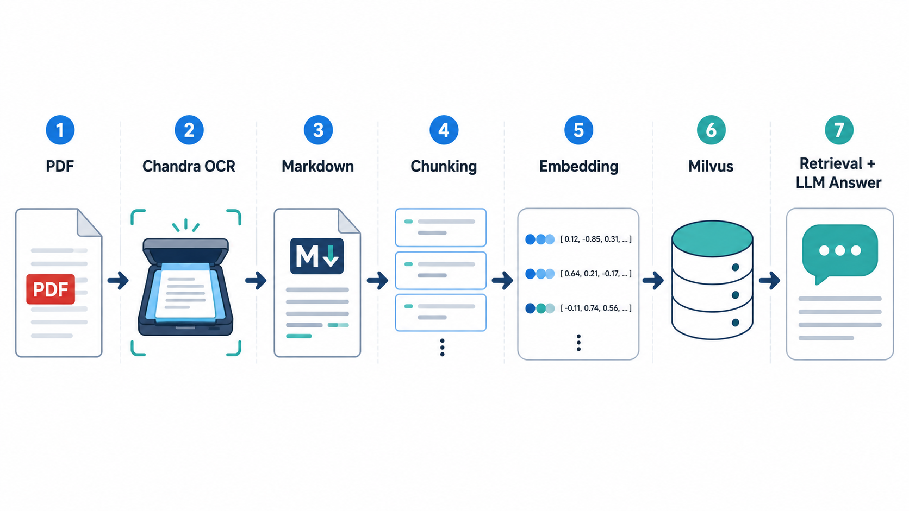
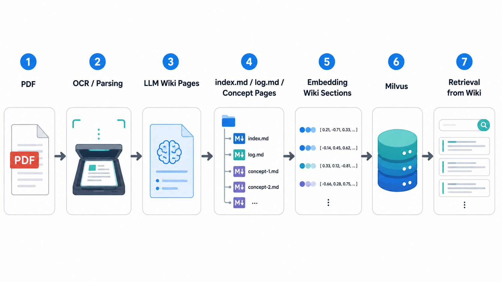

# LLM Wiki：把 RAG 知識庫整理成可累積的 Markdown Wiki

上一節建立的是傳統 RAG 流程：

```text
PDF
-> Chandra OCR
-> Markdown
-> chunking
-> embedding
-> Milvus
-> retrieval
-> LLM answer
```



這種做法很直覺，也很適合第一版系統。

但它有一個限制：每次回答問題時，LLM 都要重新從 raw chunks 裡找資料、拼上下文、整理答案。系統本身不會累積「已經整理過的知識」。

**LLM Wiki** 的想法是：在 raw documents 和 retrieval 之間，多建立一層由 LLM 維護的知識整理層。

```text
PDF
-> OCR / parsing
-> LLM 整理成 wiki pages
-> index.md / log.md / concept pages
-> embedding wiki sections
-> Milvus
-> retrieval from wiki
```



這一層不是取代原始資料，而是把原始資料整理成更容易閱讀、查詢、比較與維護的 Markdown wiki。

## 一、核心概念

傳統 RAG 查的是「原始資料 chunks」。
LLM Wiki 查的是「整理後的知識頁面」。

可以把兩者差異想成：

```text
Traditional RAG:
每次提問時，從原始文件片段重新找答案

LLM Wiki:
先把原始文件整理成 wiki，提問時查整理後的知識層
```

LLM Wiki 的目標不是讓 LLM 隨意改寫資料，而是讓 LLM 做這些維護工作：

```text
整理每份來源文件的摘要
建立核心概念頁
把相關概念互相連結
記錄資料來源
標註不同文件之間的關係
持續更新 index.md 和 log.md
```

例如 AI Agent 課程資料中，可能會整理出這些頁面：

```text
concepts/agent_memory.md
concepts/tool_use.md
concepts/mcp.md
concepts/agent_quality.md
concepts/context_engineering.md
comparisons/memory_vs_context_engineering.md
summaries/introduction_to_agents.md
```

之後使用者問：

```text
How is memory different from context engineering?
```

傳統 RAG 需要從多份 PDF chunks 裡找相關段落。
LLM Wiki 則可能已經有一份比較頁，直接整理過兩者差異與來源。

## 二、和傳統 RAG 共用的前處理

LLM Wiki 不代表不需要 OCR、metadata 或 Milvus。

前半段仍然和傳統 RAG 共用：

```text
data/2025_AI_Agent_Course/*.pdf
-> Chandra OCR
-> Markdown / HTML / metadata
```

資料來源：

```text
data/2025_AI_Agent_Course/
```

目前包含：

```text
Agent Quality.pdf
Agent Tools & Interoperability with Model Context Protocol.pdf
Context Engineering_ Sessions & Memory.pdf
Introduction to Agents.pdf
Prototype to Production.pdf
```

Chandra 輸出建議放在：

```text
data/end_to_end_RAG/chandra_output/
```

後續會從 Chandra 產生的 Markdown 建立兩條 pipeline：

```text
Chandra Markdown
├── Traditional RAG：直接切 raw chunks
└── LLM Wiki：先整理成 wiki pages，再切 wiki chunks
```

這樣比較公平，因為兩邊使用相同 raw source 和相同 OCR 結果。

## 三、建議資料夾架構

建議把 LLM Wiki 放在 `data/end_to_end_RAG/llm_wiki/`：

```text
data/end_to_end_RAG/
├── chandra_output/
├── traditional_rag/
│   └── chunks.jsonl
└── llm_wiki/
    ├── wiki/
    │   ├── index.md
    │   ├── log.md
    │   ├── overview.md
    │   ├── sources/
    │   ├── concepts/
    │   ├── comparisons/
    │   └── questions/
    ├── processed/
    │   └── wiki_chunks.jsonl
    └── logs/
```

各資料夾用途：

| 路徑 | 用途 |
| --- | --- |
| `wiki/index.md` | wiki 目錄，列出所有頁面與一句話摘要 |
| `wiki/log.md` | 追加式紀錄，記錄每次 ingest、更新、查詢整理 |
| `wiki/overview.md` | 對整個 AI Agent 課程的總覽 |
| `wiki/sources/` | 每份 PDF 對應的來源摘要 |
| `wiki/concepts/` | 核心概念頁，例如 memory、MCP、agent quality |
| `wiki/comparisons/` | 跨概念比較頁 |
| `wiki/questions/` | 有價值的問答或分析結果，可沉澱回 wiki |
| `processed/wiki_chunks.jsonl` | 切分後準備寫入 Milvus 的 wiki chunks |

這裡的 wiki 是 LLM 維護的 Markdown 知識庫。
Milvus 則負責把 wiki pages 轉成可檢索的向量資料。

## 四、Wiki Page 設計

LLM Wiki 建議每個 Markdown 頁面都使用固定格式，避免後續維護混亂。

例如 concept page：

```markdown
---
title: Agent Memory
type: concept
sources:
  - Context Engineering_ Sessions & Memory.pdf
tags:
  - agent
  - memory
  - context-engineering
updated: 2026-05-15
---

# Agent Memory

## Summary

...

## Key Ideas

...

## Related Concepts

- [Context Engineering](./context_engineering.md)
- [Sessions](./sessions.md)

## Source Notes

- Context Engineering_ Sessions & Memory.pdf, page 3
- Context Engineering_ Sessions & Memory.pdf, page 8
```

建議固定欄位：

| 欄位 | 說明 |
| --- | --- |
| `title` | 頁面標題 |
| `type` | `source`、`concept`、`comparison`、`question` |
| `sources` | 這頁依據哪些原始文件 |
| `tags` | 方便分類與搜尋 |
| `updated` | 最後更新日期 |

這些欄位之後可以轉成 Milvus metadata。

## 五、核心 Wiki 檔案

### 5.1 `index.md`

`index.md` 是 wiki 的目錄。

它的目的不是放完整內容，而是讓 LLM 和使用者快速知道有哪些頁面。

範例：

```markdown
# AI Agent Course Wiki Index

## Overview

- [Course Overview](./overview.md)：AI Agent 課程總覽。

## Sources

- [Introduction to Agents](./sources/introduction_to_agents.md)：介紹 agent 的基本定義與架構。
- [Agent Quality](./sources/agent_quality.md)：整理 agent 評估、品質與可靠性。

## Concepts

- [Agent Memory](./concepts/agent_memory.md)：agent 如何保存與使用記憶。
- [MCP](./concepts/mcp.md)：Model Context Protocol 與工具互通。
- [Context Engineering](./concepts/context_engineering.md)：如何設計 context、session 與 memory。

## Comparisons

- [Memory vs Context Engineering](./comparisons/memory_vs_context_engineering.md)
```

回答問題時，LLM 可以先讀 `index.md`，再決定要讀哪些頁面。

### 5.2 `log.md`

`log.md` 是追加式紀錄。

它用來記錄 wiki 發生過什麼事：

```markdown
# Wiki Log

## [2026-05-15] ingest | Introduction to Agents

- Added `sources/introduction_to_agents.md`
- Updated `overview.md`
- Created `concepts/agent_architecture.md`

## [2026-05-15] query | memory vs context engineering

- Added `comparisons/memory_vs_context_engineering.md`
- Updated `concepts/agent_memory.md`
```

這份 log 很重要，因為 wiki 會持續累積。
未來如果內容出錯或過時，可以追蹤是哪次 ingest 或 query 造成的。

## 六、Ingest 流程

LLM Wiki 的 ingest 流程不是單純切 chunk。

比較合理的步驟是：

```text
1. 選一份 Chandra Markdown
2. LLM 閱讀該文件
3. 產生 source summary page
4. 找出核心 concepts
5. 新增或更新 concept pages
6. 更新 overview.md
7. 更新 index.md
8. 在 log.md 加一筆紀錄
```

例如處理：

```text
Introduction to Agents.pdf
```

可能會產生或更新：

```text
wiki/sources/introduction_to_agents.md
wiki/concepts/agent_definition.md
wiki/concepts/agent_loop.md
wiki/concepts/tool_use.md
wiki/overview.md
wiki/index.md
wiki/log.md
```

也就是說，一份來源文件可能會影響多個 wiki pages。

這就是 LLM Wiki 和傳統 RAG 最大差異：

```text
Traditional RAG：來源文件切成 chunks 後就結束
LLM Wiki：來源文件會被整合進一個持續更新的知識結構
```

## 七、Milvus Indexing 設計

LLM Wiki 仍然可以使用 Milvus。

但 Milvus 儲存的不是 raw PDF chunks，而是 wiki pages 或 wiki sections。

建議 collection：

```text
ai_agent_course_wiki
```

欄位設計：

| 欄位 | 類型 | 說明 |
| --- | --- | --- |
| `id` | `VARCHAR` | wiki chunk id |
| `text` | `VARCHAR` | wiki section 文字 |
| `vector` | `FLOAT_VECTOR` | wiki section embedding |
| `wiki_path` | `VARCHAR` | 例如 `concepts/agent_memory.md` |
| `page_type` | `VARCHAR` | `source`、`concept`、`comparison`、`question` |
| `title` | `VARCHAR` | wiki page title |
| `source_refs` | `VARCHAR` | 原始來源引用，可用 JSON string |
| `tags` | `VARCHAR` | tags，可用 JSON string |
| `updated` | `VARCHAR` | 更新日期 |

其中 `source_refs` 很重要。

LLM Wiki 一定要保留它整理內容時依據的來源，例如：

```json
[
  "Context Engineering_ Sessions & Memory.pdf#page=3",
  "Context Engineering_ Sessions & Memory.pdf#page=8"
]
```

否則 wiki 雖然好讀，但會失去可追溯性。

## 八、查詢模式

建議不要只做一種查詢模式，而是做三種：

```text
raw
wiki
wiki_grounded
```

### 8.1 Raw Mode

Raw mode 就是傳統 RAG：

```text
query
-> Milvus raw collection
-> retrieve raw chunks
-> LLM answer
```

適合：

```text
查原文細節
查某份文件的具體內容
需要頁碼與原始引用
```

### 8.2 Wiki Mode

Wiki mode 只查 wiki：

```text
query
-> Milvus wiki collection
-> retrieve wiki pages / sections
-> LLM answer
```

適合：

```text
概念型問題
跨文件總結
比較與歸納
學習路線整理
```

### 8.3 Wiki-grounded Mode

Wiki-grounded mode 是我最推薦的版本：

```text
query
-> retrieve wiki sections
-> 讀取 wiki section 的 source_refs
-> 回到 raw collection 找原始 chunks
-> LLM 用 wiki synthesis + raw evidence 回答
```

它的優點是：

```text
wiki 提供整理後的理解
raw chunks 提供原始證據
最後答案比較有結構，也比較可追溯
```

這個模式很適合拿來和傳統 RAG 比較。

## 九、評估問題設計

為了比較 Traditional RAG 和 LLM Wiki，問題集要刻意涵蓋不同類型。

| 問題類型 | 範例 |
| --- | --- |
| 原文細節 | What are the key components of an AI agent? |
| 概念解釋 | What is context engineering? |
| 跨文件比較 | Compare agent memory and context engineering. |
| 實務風險 | What risks appear when moving agents from prototype to production? |
| 工具與協定 | How does MCP help agent tool interoperability? |
| 品質評估 | How can we evaluate agent quality? |

預期結果通常會是：

```text
raw mode 對原文細節和頁碼引用較穩
wiki mode 對概念總結和跨文件比較較穩
wiki_grounded mode 在結構化回答和來源追蹤之間取得平衡
```

## 十、實作順序

建議實作順序：

```text
1. 先完成 Traditional RAG baseline
2. 建立 wiki 目錄與 WIKI_SCHEMA.md
3. 手動或半自動處理第一份 Chandra Markdown
4. 產生第一批 wiki pages
5. 把 wiki pages 切 chunk 並寫入 Milvus
6. 實作 wiki mode query
7. 實作 wiki_grounded mode query
8. 用同一組問題比較三種模式
```

這裡不要一開始就全自動。

比較好的方式是先人工 review 幾次 LLM 產生的 wiki pages，確定格式和 source refs 正確，再逐步自動化。

## 十一、WIKI_SCHEMA.md 的角色

LLM Wiki 需要一份規則文件，告訴 LLM 如何維護 wiki。

可以放在：

```text
chapter/end_to_end_RAG/WIKI_SCHEMA.md
```

它應該定義：

```text
wiki 目錄結構
page type
frontmatter 欄位
source citation 格式
index.md 更新規則
log.md 更新規則
新增概念頁的條件
如何處理矛盾資訊
如何回答查詢
```

沒有 schema 的 LLM Wiki 很容易變成普通摘要資料夾。
有 schema，LLM 才能穩定地維護同一套知識結構。

## 十二、和傳統 RAG 的比較

### 12.1 Traditional RAG 的優缺點

Traditional RAG 的優點是簡單、直接、忠於原始資料。

| 優點 | 說明 |
| --- | --- |
| 建置速度快 | OCR 後直接 chunk、embedding、寫入 Milvus |
| 原文追蹤清楚 | chunk metadata 可以直接保留 PDF、頁碼、段落 |
| 適合查細節 | 對「某份文件寫了什麼」這類問題很穩 |
| 維護成本低 | 新增文件時重新 ingest 即可，不需要維護 wiki 結構 |
| 較少整理偏差 | 不會先經過 LLM 大量改寫或摘要 |

但 Traditional RAG 的限制也很明顯：

| 缺點 | 說明 |
| --- | --- |
| 跨文件整合較弱 | 每次都依賴 query-time retrieval 臨時拼接上下文 |
| 容易受 chunk 品質影響 | chunk 切太碎會缺上下文，切太大又會有雜訊 |
| 不會累積知識 | 系統不會把過去整理出的概念沉澱成固定知識頁 |
| 概念關係不明確 | 多份文件之間的關係需要每次回答時重新推理 |
| 回答結構不一定穩定 | 同類問題可能因為取回 chunks 不同而回答風格不一致 |

### 12.2 LLM Wiki 的優缺點

LLM Wiki 的優點是它會把資料整理成可持續維護的知識結構。

| 優點 | 說明 |
| --- | --- |
| 適合知識累積 | 概念、比較、總結可以沉澱成 wiki pages |
| 跨文件整合較強 | LLM 可以把多份來源整理成同一個概念頁 |
| 回答更有結構 | 查到的是整理後的知識頁，比 raw chunks 更接近教學筆記 |
| 適合學習型知識庫 | 很適合課程、研究筆記、技術主題整理 |
| 可加入人工審稿 | Markdown wiki 可以被人檢查、修改、版本控管 |

但 LLM Wiki 也不是免費的提升：

| 缺點 | 說明 |
| --- | --- |
| 建置成本較高 | 需要 LLM 生成 wiki pages，也需要設計 schema |
| 需要維護規則 | 沒有 `index.md`、`log.md`、frontmatter 規範會很快混亂 |
| 可能有摘要偏差 | LLM 整理時可能漏掉細節或過度概括 |
| 來源追蹤要特別設計 | 如果沒有 `source_refs`，wiki 會變成不可追溯的摘要 |
| 更新流程較複雜 | 新資料進來時，不只是新增 chunk，還可能要更新既有概念頁 |

因此比較實際的做法不是二選一，而是：

```text
Traditional RAG 保留原始證據
LLM Wiki 負責知識整理
Wiki-grounded RAG 把兩者串起來
```

### 12.3 整體比較

| 面向 | Traditional RAG | LLM Wiki | Wiki-grounded RAG |
| --- | --- | --- | --- |
| 主要索引內容 | 原始文件 chunks | 整理後的 wiki pages | wiki pages + raw chunks |
| 建置難度 | 低 | 中 | 高 |
| 查原文細節 | 強 | 中 | 強 |
| 跨文件整合 | 中 | 強 | 強 |
| 概念總結 | 中 | 強 | 強 |
| 來源追蹤 | 強 | 取決於 source refs 設計 | 強 |
| 維護成本 | 低 | 中到高 | 高 |
| 幻覺風險 | 取決於 retrieval | wiki 生成時可能引入摘要偏差 | 較低，因為可回查 raw evidence |
| 適合用途 | 文件問答、查細節 | 學習筆記、研究整理、知識庫累積 | 高品質回答、需要整理也需要證據 |

更直覺地看：

```text
Traditional RAG
= 每次從原始資料重新找答案

LLM Wiki
= 先把資料整理成知識結構，再查整理後的結果

Wiki-grounded RAG
= 先用 wiki 找理解，再用 raw chunks 找證據
```

## 十三、本節重點

LLM Wiki 的價值不在於取代 RAG，而是在 RAG 前面增加一個可以累積的知識整理層。

對這個 AI Agent 課程知識庫來說，建議架構是：

```text
PDF
-> Chandra OCR
-> Markdown
├── Traditional RAG raw chunks
└── LLM Wiki pages
    ├── index.md
    ├── log.md
    ├── sources/
    ├── concepts/
    └── comparisons/
```

最後再用 Milvus 建立兩個 collection：

```text
ai_agent_course_raw
ai_agent_course_wiki
```

查詢時可以比較：

```text
raw mode
wiki mode
wiki_grounded mode
```

這樣就能清楚展示傳統 RAG 和 LLM Wiki 的差異，也能保留後續擴充到 hybrid search、rerank、context compression 的空間。
