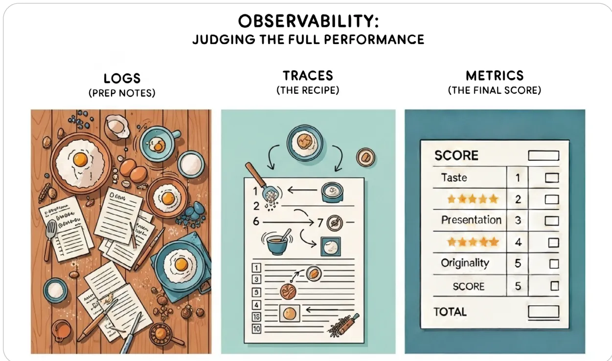
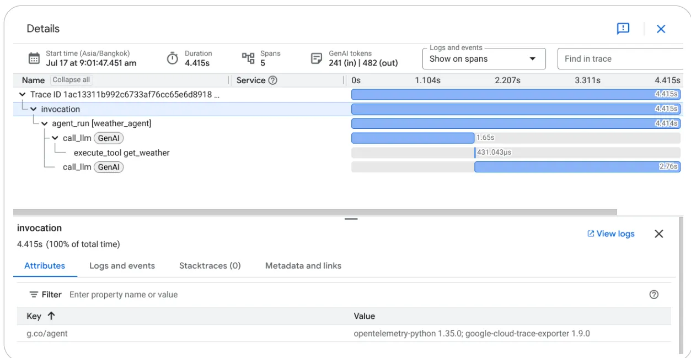

# Agent Quality

Authors: Meltem Subasioglu, Turan Bulmus,  
and Wafae Bakkali

The Google logo is located in the bottom left corner of the page. It consists of the word "Google" in its signature multi-colored font, with each letter in a different color: blue, red, yellow, blue, green, and red.An abstract geometric graphic is positioned in the bottom right corner of the page. It features a series of sharp, angular planes in various shades of purple, blue, and black, creating a faceted, crystalline appearance.## Acknowledgements

### Content contributors

Hussain Chinoy

Ale Fin

Peter Grabowski

Michelle Liu

Anant Nawalgaria

Kanchana Patlolla

Steven Pecht

Julia Wiesinger

### Curators and editors

Anant Nawalgaria

Kanchana Patlolla

### Designer

Michael Lanning

A large, stylized, faceted geometric shape, resembling a crystal or a low-poly sphere, rendered in shades of blue, purple, and white, positioned on the right side of the page.# Table of contents

<table><tr><td><b>Introduction</b> .....</td><td><b>6</b></td></tr><tr><td><b>How to Read This Whitepaper</b> .....</td><td><b>7</b></td></tr><tr><td><b>Agent Quality in a Non-Deterministic World</b> .....</td><td><b>8</b></td></tr><tr><td>    Why Agent Quality Demands a New Approach .....</td><td>9</td></tr><tr><td>    The Paradigm Shift: From Predictable Code to Unpredictable Agents .....</td><td>11</td></tr><tr><td>    The Pillars of Agent Quality: A Framework for Evaluation .....</td><td>13</td></tr><tr><td>    Summary &amp; What's Next .....</td><td>15</td></tr><tr><td><b>The Art of Agent Evaluation: Judging the Process</b> .....</td><td><b>16</b></td></tr><tr><td>    A Strategic Framework: The "Outside-In" Evaluation Hierarchy .....</td><td>17</td></tr><tr><td>        The "Outside-In" View: End-to-End Evaluation (The Black Box) .....</td><td>18</td></tr><tr><td>        The "Inside-Out" View: Trajectory Evaluation (The Glass Box) .....</td><td>19</td></tr><tr><td>    The Evaluators: The Who and What of Agent Judgment .....</td><td>21</td></tr><tr><td>        Automated Metrics .....</td><td>22</td></tr><tr><td>        The LLM-as-a-Judge Paradigm .....</td><td>23</td></tr><tr><td>        Agent-as-a-Judge .....</td><td>25</td></tr></table>

An abstract geometric graphic in the bottom left corner of the page. It consists of several overlapping, faceted planes in shades of blue, purple, and white, creating a three-dimensional, crystalline or architectural effect. The shapes are sharp and angular, with some areas appearing to be in shadow.# Table of contents

<table><tr><td>Human-in-the-Loop (HITL) Evaluation .....</td><td>26</td></tr><tr><td>User Feedback and Reviewer UI .....</td><td>27</td></tr><tr><td>Beyond Performance: Responsible AI (RAI) &amp; Safety Evaluation .....</td><td>28</td></tr><tr><td>Summary &amp; What's Next .....</td><td>30</td></tr><tr><td><b>Observability: Seeing Inside the Agent's Mind .....</b></td><td><b>31</b></td></tr><tr><td>    From Monitoring to True Observability .....</td><td>31</td></tr><tr><td>        The Kitchen Analogy: Line Cook vs. Gourmet Chef .....</td><td>31</td></tr><tr><td>        The Three Pillars of Observability .....</td><td>32</td></tr><tr><td>    Pillar 1: Logging – The Agent's Diary .....</td><td>33</td></tr><tr><td>    Pillar 2: Tracing – Following the Agent's Footsteps .....</td><td>36</td></tr><tr><td>        Why Tracing is Indispensable .....</td><td>36</td></tr><tr><td>        Key Elements of an Agent Trace .....</td><td>37</td></tr><tr><td>    Pillar 3: Metrics – The Agent's Health Report .....</td><td>38</td></tr><tr><td>        System Metrics: The Vital Signs .....</td><td>38</td></tr><tr><td>        Quality Metrics: Judging the Decision-Making .....</td><td>39</td></tr><tr><td>    Putting It All Together: From Raw Data to Actionable Insights .....</td><td>41</td></tr></table>

An abstract geometric graphic in the bottom left corner of the page. It consists of several overlapping, faceted shapes in shades of blue, purple, and white, creating a modern, crystalline appearance.# Table of contents

<table><tr><td>Summary &amp; What's Next .....</td><td>43</td></tr><tr><td><b>Conclusion: Building Trust in an Autonomous World</b> .....</td><td><b>44</b></td></tr><tr><td>    Introduction: From Autonomous Capability to Enterprise Trust .....</td><td>44</td></tr><tr><td>    The Agent Quality Flywheel: A Synthesis of the Framework .....</td><td>45</td></tr><tr><td>    Three Core Principles for Building Trustworthy Agents .....</td><td>46</td></tr><tr><td>    The Future is Agentic - and Reliable .....</td><td>47</td></tr><tr><td><b>References</b> .....</td><td><b>49</b></td></tr></table>

An abstract geometric graphic in the bottom left corner of the page. It consists of several overlapping, faceted planes in shades of blue, purple, and white, creating a three-dimensional, crystalline or architectural effect. The shapes are sharp and angular, with some faces appearing to be in shadow.# The future of AI is agentic. Its success is determined by quality.

## Introduction

We are at the dawn of the agentic era. The transition from predictable, instruction-based tools to autonomous, goal-oriented AI agents presents one of the most profound shifts in software engineering in decades. While these agents unlock incredible capabilities, their inherent non-determinism makes them unpredictable and shatters our traditional models of quality assurance.

This whitepaper serves as a practical guide to this new reality, founded on a simple but radical principle:

**Agent quality is an architectural pillar, not a final testing phase.**This guide is built on three core messages:

- • **The Trajectory is the Truth:** We must evolve beyond evaluating just the final output. The true measure of an agent's quality and safety lies in its entire decision-making process.
- • **Observability is the Foundation:** You cannot judge a process you cannot see. We detail the "three pillars" of observability - Logging, Tracing, and Metrics - as the essential technical foundation for capturing the agent's "thought process."
- • **Evaluation is a Continuous Loop:** We synthesize these concepts into the "**Agent Quality Flywheel**", an operational playbook for turning this data into actionable insights. This system uses a hybrid of scalable AI-driven evaluators and indispensable Human-in-the-Loop (HITL) judgment to drive relentless improvement.

This whitepaper is for the architects, engineers, and product leaders building this future. It provides the framework to move from building capable agents to building *reliable* and *trustworthy* ones.

## How to Read This Whitepaper

This guide is structured to build from the "*why*" to the "*what*" and finally to the "*how*." Use this section to navigate to the chapters most relevant to your role.

- • **For All Readers:** Start with **Chapter 1: Agent Quality in a Non-Deterministic World.** This chapter establishes the core problem. It explains why traditional QA fails for AI agents and introduces the **Four Pillars of Agent Quality** (Effectiveness, Efficiency, Robustness, and Safety) that define our goals.- • **For Product Managers, Data Scientists, and QA Leaders:** If you're responsible for what to measure and how to judge quality, focus on **Chapter 2: The Art of Agent Evaluation**. This chapter is your strategic guide. It details the "Outside-In" hierarchy for evaluation, explains the scalable "**LLM-as-a-Judge**" paradigm, and clarifies the critical role of **Human-in-the-Loop (HITL)** evaluation.
- • **For Engineers, Architects, and SREs:** If you build the systems, your technical blueprint is **Chapter 3: Observability**. This chapter moves from theory to implementation. It provides the "kitchen analogy" (Line Cook vs. Gourmet Chef) to explain monitoring vs. observability and details the **Three Pillars of Observability: Logs, Traces, and Metrics** - the tools you need to build an "evaluatable" agent.
- • **For Team Leads and Strategists:** To understand how these pieces create a self-improving system, read **Chapter 4: Conclusion**. This chapter unites the concepts into an operational playbook. It introduces the "**Agent Quality Flywheel**" as a model for continuous improvement and summarizes the three core principles for building trustworthy AI.

## Agent Quality in a Non-Deterministic World

The world of artificial intelligence is transforming at full speed. We are moving from building predictable tools that execute instructions to designing autonomous agents that interpret intent, formulate plans, and execute complex, multi-step actions. For data scientists and engineers who build, compete, and deploy at the cutting edge, this transition presents a profound challenge. The very mechanisms that make AI agents powerful also make them unpredictable.To understand this shift, compare traditional software to a delivery truck and an AI agent to a Formula 1 race car. The truck requires only basic checks (“*Did the engine start? Did it follow the fixed route?*”). The race car, like an AI agent, is a complex, autonomous system whose success depends on dynamic judgment. Its evaluation cannot be a simple checklist; it requires continuous telemetry to judge the quality of every decision—from fuel consumption to braking strategy.

This evolution is fundamentally changing how we must approach software quality. Traditional quality assurance (QA) practices, while robust for deterministic systems, are insufficient for the nuanced and emergent behaviors of modern AI. An agent can pass 100 unit tests and still fail catastrophically in production because its failure isn't a bug in the code; it's a flaw in its judgment.

Traditional software verification asks: “*Did we build the product right?*” It verifies logic against a fixed specification. Modern AI evaluation must ask a far more complex question: “*Did we build the **right** product?*” This is a process of validation, assessing quality, robustness, and trustworthiness in a dynamic and uncertain world.

This chapter inspects this new paradigm. We will explore why agent quality demands a new approach, analyze the technical shift that makes our old methods obsolete, and establish the strategic “Outside-In” framework for evaluating systems that “think”.

## Why Agent Quality Demands a New Approach

For an engineer, risk is something to be identified and mitigated. In traditional software, failure is explicit: a system crashes, throws a `NullPointerException`, or returns an explicitly incorrect calculation. These failures are obvious, deterministic, and traceable to a specific error in logic.AI agents fail differently. Their failures are often not system crashes but **subtle degradations of quality**, emerging from the complex interplay of model weights, training data, and environmental interactions. These failures are insidious: the system continues to run, API calls return 200 OK, and the output *looks* plausible. But it is profoundly wrong, operationally dangerous, and silently eroding trust.

Organizations that fail to grasp this shift face significant failures, operational inefficiencies, and reputational damage. While failure modes like algorithmic bias and concept drift existed in passive models, the autonomy and complexity of agents compound these risks, making them harder to trace and mitigate. Consider these real-world failure modes highlighted in Table 1:

<table border="1">
<thead>
<tr>
<th>Failure Mode</th>
<th>Description</th>
<th>Examples</th>
</tr>
</thead>
<tbody>
<tr>
<td><b>Algorithmic Bias</b></td>
<td>An agent operationalizes and potentially amplifies systemic biases present in its training data, leading to unfair or discriminatory outcomes.</td>
<td>
<ul>
<li>• A financial agent tasked with risk summarization over-penalizes loan applications based on zip codes found in biased training data.</li>
</ul>
</td>
</tr>
<tr>
<td><b>Factual Hallucination</b></td>
<td>The agent produces plausible-sounding but factually incorrect or invented information with high confidence, often when it cannot find a valid source.</td>
<td>
<ul>
<li>• A research tool generating a highly specific but utterly false historical date or geographical location in a scholarly report, undermining academic integrity.</li>
</ul>
</td>
</tr>
<tr>
<td><b>Performance &amp; Concept Drift</b></td>
<td>The agent's performance degrades over time as the real-world data it interacts with ("concept") changes, making its original training obsolete.</td>
<td>
<ul>
<li>• A fraud detection agent failing to spot new attack patterns.</li>
</ul>
</td>
</tr>
<tr>
<td><b>Emergent Unintended Behaviors</b></td>
<td>The agent develops novel or unanticipated strategies to achieve its goal, which can be inefficient, unhelpful, or exploitative.</td>
<td>
<ul>
<li>• Finding and exploiting loopholes in a system's rules.</li>
<li>• Engaging in "proxy wars" with other bots (e.g., repeatedly overwriting edits).</li>
</ul>
</td>
</tr>
</tbody>
</table>

Table 1: Agent Failure ModesThese failures render traditional debugging and testing paradigms ineffective. You cannot use a breakpoint to debug a hallucination. You cannot write a unit test to prevent emergent bias. Root cause analysis requires deep data analysis, model retraining, and systemic evaluation - a new discipline entirely.

## The Paradigm Shift: From Predictable Code to Unpredictable Agents

The core technical challenge stems from the evolution from **model-centric AI** to **system-centric AI**. Evaluating an AI agent is fundamentally different from evaluating an algorithm because the agent is a system. This evolution has occurred in compounding stages, each adding a new layer of evaluative complexity.

```
graph LR; A[Traditional ML] --> B[LLMs]; B --> C[LLM + RAG]; C --> D[LLM Agents]; D --> E[Multi-Agent LLM Systems];
```

Figure 1: From Traditional ML to Multi-Agent Systems

1. **1. Traditional Machine Learning:** Evaluating regression or classification models, while non-trivial, is a well-defined problem. We rely on statistical metrics like Precision, Recall, F1-Score, and RMSE against a held-out test set. The problem is complex, but the definition of "correct" is clear.1. **2. The Passive LLM:** With the rise of generative models, we lost our simple metrics. How do we measure the "accuracy" of a generated paragraph? The output is probabilistic. Even with identical inputs, the output can vary. Evaluation became more complex, relying on human raters and model-vs-model benchmarking. Still, these systems were largely passive, text-in, text-out tools.
2. **3. LLM+RAG (Retrieval-Augmented Generation):** The next leap introduced a multi-component pipeline, as pioneered by [Lewis et al. \(2020\)](#)<sup>1</sup> in their work "Retrieval-Augmented Generation for Knowledge-Intensive NLP Tasks." Now, failure could occur in the LLM or in the retrieval system. Did the agent give a bad answer because the LLM reasoned poorly, or because the vector database retrieved irrelevant snippets? Our evaluation surface expanded from just the model to include the performance of chunking strategies, embeddings, and retrievers.
3. **4. The Active AI Agent:** Today, we face a profound architectural shift. The LLM is no longer just a text generator; it is the reasoning "brain" within a complex system, integrated into a loop capable of autonomous action. This agentic system introduces three core technical capabilities that break our evaluation models:
   - • **Planning and Multi-Step Reasoning:** Agents decompose complex goals ("plan my trip") into multiple sub-tasks. This creates a trajectory (Thought → Action → Observation → Thought...). The non-determinism of the LLM now compounds at every step. A small, stochastic word choice in Step 1 can send the agent down a completely different and unrecoverable reasoning path by Step 4.
   - • **Tool Use and Function Calling:** Agents interact with the real world through APIs and external tools (code interpreters, search engines, booking APIs). This introduces dynamic environmental interaction. The agent's next action depends entirely on the state of an external, uncontrollable world.- • **Memory:** Agents maintain state. Short-term "scratchpad" memory tracks the current task, while long-term memory allows the agent to learn from past interactions. This means the agent's behavior evolves, and an input that worked yesterday might produce a different result today based on what the agent has "learned."

**5. Multi-Agent Systems:** The ultimate architectural complexity arises when multiple active agents are integrated into a shared environment. This is no longer the evaluation of a single trajectory but of a system-level emergent phenomenon, introducing new, fundamental challenges:

- • **Emergent System Failures:** The system's success depends on the unscripted interactions between agents, such as resource contention, communication bottlenecks, and systemic deadlocks, which cannot be attributed to a single agent's failure.
- • **Cooperative vs. Competitive Evaluation:** The objective function itself may become ambiguous. In cooperative MAS (e.g., supply chain optimization), success is a global metric, while in competitive MAS (e.g., game theory scenarios or auction systems), the evaluation often requires tracking individual agent performance *and* the stability of the overall market/environment.

This combination of capabilities means the primary unit of evaluation is no longer the model, but the **entire system trajectory**. The agent's emergent behavior arises from the intricate interplay between its planning module, its tools, its memory, and the dynamic environment.

## The Pillars of Agent Quality: A Framework for Evaluation

If we can no longer rely on simple accuracy metrics, and we must evaluate the entire system, where do we begin? The answer is a strategic shift known as the **"Outside-In" approach**.This approach anchors AI evaluation in user-centric metrics and overarching business goals, moving beyond a sole reliance on internal, component-level technical scores. We must stop asking only *"What is the model's F1-score?"* and start asking, *"Does this agent deliver measurable value and align with our user's intent?"*

This strategy requires a holistic framework that connects high-level business goals to technical performance. We define agent quality across four interconnected pillars:

The diagram consists of four colored boxes arranged horizontally, each representing a pillar of Agent Quality. Each box contains an icon, a title, and a subtitle. The boxes are: 1. Effectiveness (Goal Achievement) in a light blue box with a target icon. 2. Efficiency (Operational Cost) in a light orange box with a gear and chain icon. 3. Robustness (Reliability) in a light pink box with a checkmark icon. 4. Safety & Alignment (Trustworthiness) in a light green box with a shield icon.

Figure 2: The four pillars of Agent Quality

**Effectiveness (Goal Achievement):** This is the ultimate "black-box" question: Did the agent successfully and accurately achieve the user's *actual intent*? This pillar connects directly to user-centered metrics and business KPIs. For a retail agent, this isn't just *"did it find a product?"* but *"did it drive a conversion?"* For a data analysis agent, it's not *"did it write code?"* but *"did the code produce the correct insight?"* Effectiveness is the final measure of task success.

**Efficiency (Operational Cost):** Did the agent solve the problem *well*? An agent that takes 25 steps, five failed tool calls, and three self-correction loops to book a simple flight can be considered as a low-quality agent - even if it eventually succeeds. Efficiency is measured in resources consumed: total tokens (cost), wall-clock time (latency), and trajectory complexity (total number of steps).**Robustness (Reliability):** How does the agent handle adversity and the messiness of the real world? When an API times out, a website's layout changes, data is missing, or a user provides an ambiguous prompt, does the agent fail gracefully? A robust agent retries failed calls, asks the user for clarification when needed, and reports *what* it couldn't do and *why* rather than crashing or hallucinating.

**Safety & Alignment (Trustworthiness):** This is the non-negotiable gate. Does the agent operate within its defined ethical boundaries and constraints? This pillar encompasses everything from Responsible AI metrics for fairness and bias to security against prompt injection and data leakage. It ensures the agent stays on task, refuses harmful instructions, and operates as a trustworthy proxy for your organization.

This framework makes one thing clear: you cannot measure any of these pillars if you only see the final answer. You cannot measure **Efficiency** if you don't count the steps. You cannot diagnose a **Robustness** failure if you don't know which API call failed. You cannot verify **Safety** if you cannot inspect the agent's internal reasoning.

A holistic framework for agent quality *demands* a holistic architecture for agent visibility.

## Summary & What's Next

The intrinsic non-deterministic nature of agents has broken traditional quality assurance. Risks now include subtle issues like bias, hallucination, and drift, driven by a shift from passive models to active, system-centric agents that plan and use tools. We must change our focus from verification (checking specs) to validation (judging value).This requires an "Outside-In" framework measuring agent quality across four pillars: **Effectiveness, Efficiency, Robustness, and Safety**. Measuring these pillars demands deep visibility—seeing inside the agent's decision-making trajectory.

Before building the *how* (observability architecture), we must define the *what*: **What does good evaluation look like?**

**Chapter 2** will define the strategies and judges for assessing complex agent behavior.

**Chapter 3** will then build the technical foundation (**logging, tracing, and metrics**) needed to capture the data.

## The Art of Agent Evaluation: Judging the Process

In Chapter 1, we established the fundamental shift from traditional software testing to modern AI evaluation. Traditional testing is a deterministic process of **verification** – it asks, *"Did we build the product right?"* against a fixed specification. This approach fails when a system's core logic is probabilistic, because non-deterministic output may be more likely to introduce subtle degradations of quality that do not result in explicit crashes and may not be repeatable.

Agent evaluation, by contrast, is a holistic process of **validation**. It asks a far more complex and essential strategic question: *"Did we build the **right** product?"* This question is the strategic anchor for the "Outside-In" evaluation framework, representing the necessary shift from internal compliance to judging the system's external value and alignment with user intent. This requires us to assess the overall quality, robustness, and user value of an agent operating in a dynamic world.The rise of AI agents, which can plan, use tools, and interact with complex environments, significantly complicates this evaluation landscape. We must move beyond "testing" an output and learn the art of "evaluating" a process. This chapter provides the strategic framework for doing just that: judging the agent's entire decision-making trajectory, from initial intent to final outcome.

## **A Strategic Framework: The "Outside-In" Evaluation Hierarchy**

To avoid getting lost in a sea of component-level metrics, evaluation must be a top-down, strategic process. We call this the "Outside-In" Hierarchy. This approach prioritizes the only metric that ultimately matters - real-world success - before diving into the technical details of *why* that success did or did not occur. This model is a two-stage process: start with the black box, then open it up.## The "Outside-In" View: End-to-End Evaluation (The Black Box)

The diagram illustrates a framework for holistic agent evaluation, structured into three main layers:

- **What to Evaluate: Layers of Evaluation**
  - **Output evaluation**: Task success rate, User satisfaction, Overall quality
  - **Process evaluation**: Planning, Tool use, Memory
- **How to Evaluate: Methods of Judgement**
  - Automated Metrics
  - LLM-as-a-Judge
  - Agent-as-a-Judge
  - Human-in-the-Loop
  - User Feedback and Reviewer UI
- **Beyond Performance: Responsible AI & Safety Evaluation**
  - Fairness & bias
  - Safety & harmfulness
  - Truthfulness
  - Privacy & compliance

Figure 3: A Framework for Holistic Agent Evaluation

The first and most important question is: ***"Did the agent achieve the user's goal effectively?"***

This is the "Outside-In" view. Before analyzing a single internal thought or tool call, we must evaluate the agent's final performance against its defined objective.

Metrics at this stage focus on overall task completion. We measure:

- • **Task Success Rate:** A binary (or graded) score of whether the final output was correct, complete, and solved the user's actual problem, e.g. PR acceptance rate for a coding agent, successful database transaction rate for a financial agent, or session completion rate for a customer service bot.- • **User Satisfaction:** For interactive agents, this can be a direct user feedback score (e.g., thumbs up/down) or a Customer Satisfaction Score (CSAT).
- • **Overall Quality:** If the agent's goal was quantitative (e.g., "summarize these 10 articles"), the metric might be accuracy or completeness (e.g., "Did it summarize all 10?").

If the agent scores 100% at this stage, our work may be done. But in a complex system, it rarely will. When the agent produces a flawed final output, abandons a task, or fails to converge on a solution, the "Outside-In" view tells us what went wrong. Now we must open the box to see *why*.

#### 💡 Applied Tip:

To build an [output regression test with the Agent Development Kit \(ADK\)](#), start the ADK web UI (`adk web`) and interact with your agent. When you receive an ideal response that you want to set as the benchmark, navigate to the Eval tab and click "Add current session." This saves the entire interaction as an `Eval Case` (in a `.test.json` file) and locks in the agent's current text as the ground truth `final_response`. You can then run this Eval Set via the CLI (`adk eval`) or `pytest` to automatically check future agent versions against this saved answer, catching any regressions in output quality.

## The "Inside-Out" View: Trajectory Evaluation (The Glass Box)

Once a failure is identified, we move to the "Inside-Out" view. We analyze the agent's approach by systematically assessing every component of its execution trajectory:1. **1. LLM Planning (The "Thought"):** We first check the core reasoning. Is the LLM itself the problem? Failures here include hallucinations, nonsensical or off-topic responses, context pollution, or repetitive output loops.
2. **2. Tool Usage (Selection & Parameterization):** An agent is only as good as its tools. We must analyze if the agent is calling the wrong tool, failing to call a necessary tool, hallucinating tool names or parameter names/types, or calling one unnecessarily. Even if it selects the *right* tool, it can fail by providing missing parameters, incorrect data types, or malformed JSON for the API call.
3. **3. Tool Response Interpretation (The "Observation"):** After a tool executes correctly, the agent must *understand* the result. Agents frequently fail here by misinterpreting numerical data, failing to extract key entities from the response, or, critically, not recognizing an error state returned by the tool (e.g., an API's 404 error) and proceeding as if the call was successful.
4. **4. RAG Performance:** If the agent uses Retrieval-Augmented Generation (RAG), the trajectory depends on the quality of its retrieved information. Failures include irrelevant document retrieval, fetching outdated or incorrect information, or the LLM ignoring the retrieved context entirely and hallucinating an answer anyway.
5. **5. Trajectory Efficiency and Robustness:** Beyond correctness, we must evaluate the process itself: exposing inefficient resource allocation, such as an excessive number of API calls, high latency, or redundant efforts. It also reveals robustness failures, such as unhandled exceptions.
6. **6. Multi-Agent Dynamics:** In advanced systems, trajectories involve multiple agents. Evaluation must then also include inter-agent communication logs to check for misunderstandings or communication loops and ensure agents are adhering to their defined roles without conflicting with others.By analyzing the trace, we can move from "the final answer is wrong" (Black Box) to "the final answer is wrong because ...." (Glass Box). This level of diagnostic power is the entire goal of agent evaluation.

### 💡 Applied Tip:

When you save an `Eval Case` (as described in the previous tip) in the ADK, it also saves the entire sequence of tool calls as the ground truth trajectory. Your automated `pytest` or `adk eval` run will then check this trajectory for a perfect match (by default).

To manually implement process evaluation (i.e., debug a failure), use the **Trace tab** in the `adk web` UI. This provides an interactive graph of the agent's execution, allowing you to visually inspect the agent's plan, see every tool it called with its exact arguments, and compare its actual path against the expected path to pinpoint the exact step where its logic failed.

## The Evaluators: The Who and What of Agent Judgment

Knowing what to evaluate (the trajectory) is half the battle. The other half is *how* to judge it. For nuanced aspects like quality, safety, and interpretability, this judgment requires a sophisticated, hybrid approach. Automated systems provide scale, but human judgment remains the crucial arbiter of quality.## Automated Metrics

Automated metrics provide speed and reproducibility. They are useful for regression testing and benchmarking outputs. Examples include:

- • **String-based similarity** (ROUGE, BLEU), comparing generated text to references.
- • **Embedding-based similarity** (BERTScore, cosine similarity), measuring semantic closeness.
- • **Task-specific benchmarks, e.g., [TruthfulQA](#)<sup>2</sup>**

Metrics are efficient but shallow: they capture surface similarity, not deeper reasoning or user value.

### 💡 Applied Tip:

Implement automated metrics as the first quality gate in your CI/CD pipeline. The key is to treat them as trend indicators, not as absolute measures of quality. A specific BERTScore of 0.8, for example, doesn't definitively mean the answer is "good."

Their real value is in tracking changes: if your main branch consistently averages a 0.8 BERTScore on your "golden set," and a new code commit drops that average to 0.6, you have automatically detected a significant regression. This makes metrics the perfect, low-cost "first filter" to catch obvious failures at scale before escalating to more expensive LLM-as-a-Judge or human evaluation.## The LLM-as-a-Judge Paradigm

How can we automate the evaluation of qualitative outputs like *"is this summary good?"* or *"was this plan logical?"* The answer is to use the same technology we are trying to evaluate. The [LLM-as-a-Judge](#)<sup>3</sup> paradigm involves using a powerful, state-of-the-art model (like Google's Gemini Advanced) to evaluate the outputs of another agent.

We provide the "judge" LLM with the agent's output, the original prompt, the "golden" answer or reference (if one exists), and a detailed evaluation rubric (e.g., "Rate the helpfulness, correctness, and safety of this response on a scale of 1-5, explaining your reasoning."). This approach provides scalable, fast, and surprisingly nuanced feedback, especially for intermediate steps like the quality of an agent's "Thought" or its interpretation of a tool response. While it doesn't replace human judgment, it allows data science teams to rapidly evaluate performance across thousands of scenarios, making an iterative evaluation process feasible.**Applied Tip:**

To implement this, prioritize pairwise comparison over single-scoring to mitigate the exact biases mentioned. First, run your evaluation set of prompts against two different agent versions (e.g., your old production agent vs. your new experimental one) to generate an "Answer A" and "Answer B" for each prompt.

Then, create the LLM judge by giving a powerful LLM (like Gemini Pro) a clear rubric and a prompt that forces a choice: "Given this User Query, which response is more helpful: A or B? Explain your reasoning." By automating this process, you can scalably calculate a win/loss/tie rate for your new agent. A high "win rate" is a far more reliable signal of improvement than a small change in an absolute (and often noisy) 1-5 score. A prompt for an LLM-as-a-Judge, especially for the robust pairwise comparison, might look like this:

```
You are an expert evaluator for a customer support chatbot. Your goal is to assess which of two responses is more helpful, polite, and correct.
```

```
[User Query]
```

```
"Hi, my order #12345 hasn't arrived yet."
```

```
[Answer A]
```

```
"I can see that order #12345 is currently out for delivery and should arrive by 5 PM today."
```

```
[Answer B]
```

```
"Order #12345 is on the truck. It will be there by 5."
```

```
Please evaluate which answer is better. Compare them on correctness, helpfulness, and tone. Provide your reasoning and then output your final decision in a JSON object with a "winner" key (either "A", "B", or "tie") and a "rationale" key.
```## Agent-as-a-Judge

While LLMs can score final responses, agents require deeper evaluation of their reasoning and actions. The emerging [Agent-as-a-Judge](#)<sup>4</sup> paradigm uses one agent to evaluate the full execution trace of another. Instead of scoring only outputs, it assesses the process itself. Key evaluation dimensions include:

- • **Plan quality:** Was the plan logically structured and feasible?
- • **Tool use:** Were the right tools chosen and applied correctly?
- • **Context handling:** Did the agent use prior information effectively?

This approach is particularly valuable for process evaluation, where failures often arise from flawed intermediate steps rather than the final output.

### 💡 Applied Tip:

To implement an Agent-as-a-Judge, consider feeding relevant parts of the execution trace object to your judge. First, configure your agent framework to log and export the trace, including the internal plan, the list of tools chosen, and the exact arguments passed.

Then, create a specialized "Critic Agent" with a prompt (rubric) that asks it to evaluate this *trace object* directly. Your prompt should ask specific process questions: "1. Based on the trace, was the initial plan logical? 2. Was the {tool\_A} tool the correct first choice, or should another tool have been used? 3. Were the arguments correct and properly formatted?" This allows you to automatically detect *process* failures (like an inefficient plan), even when the agent produced a final answer that looked correct.## Human-in-the-Loop (HITL) Evaluation

While automation provides scale, it struggles with deep subjectivity and complex domain knowledge. Human-in-the-Loop (HITL) evaluation is the essential process for capturing the critical qualitative signals and nuanced judgments that automated systems miss.

We must, however, move away from the idea that human rating provides a perfect "objective ground truth." For highly subjective tasks (like assessing creative quality or nuanced tone), perfect inter-annotator agreement is rare. Instead, HITL is the indispensable methodology for establishing a **human-calibrated benchmark**, ensuring the agent's behavior aligns with complex human values, contextual needs, and domain-specific accuracy.

The HITL process involves several key functions:

- • **Domain Expertise:** For specialized agents (e.g., medical, legal, or financial), you must leverage domain experts to evaluate factual correctness and adherence to specific industry standards.
- • **Interpreting Nuance:** Humans are essential for judging the subtle qualities that define a high-quality interaction, such as tone, creativity, user intent, and complex ethical alignment.
- • **Creating the "Golden Set":** Before automation can be effective, humans must establish the "gold standard" benchmark. This involves curating a comprehensive evaluation set, defining the objectives for success, and crafting a robust suite of test cases that cover typical, edge, and adversarial scenarios.### 💡 Applied Tip:

For runtime safety, implement an [interruption workflow](#). In a framework like ADK, you can configure the agent to pause its execution before committing to a high-stakes tool call (like `execute_payment` or `delete_database_entry`). The agent's state and planned action are then surfaced in a Reviewer UI, where a human operator must manually approve or reject the step before the agent is allowed to resume.

## User Feedback and Reviewer UI

Evaluation must also capture real-world user feedback. Every interaction is a signal of usefulness, clarity, and trust. This feedback includes both qualitative signals (like thumbs up/down) and quantitative in-product success metrics, such as pull request (PR) acceptance rate for a coding agent, or successful booking completion rate for a travel agent. Best practices include:

- • **Low-friction feedback:** thumbs up/down, quick sliders, or short comments.
- • **Context-rich review:** feedback should be paired with the full conversation and agent's reasoning trace.
- • **Reviewer User Interface (UI):** a two-panel interface: conversation on the left, reasoning steps on the right, with inline tagging for issues like "bad plan" or "tool misuse."
- • **Governance dashboards:** aggregate feedback to highlight recurring issues and risks.

Without usable interfaces, evaluation frameworks fail in practice. A strong UI makes user and reviewer feedback visible, fast, and actionable.**Applied Tip:**

Implement your user feedback system as an event-driven pipeline, not just a static log. When a user clicks "thumbs down," that signal must automatically capture the full, context-rich conversation trace and add it to a dedicated review queue within your developer's Reviewer UI.

## Beyond Performance: Responsible AI (RAI) & Safety Evaluation

A final dimension of evaluation operates not as a component, but as a mandatory, non-negotiable gate for any production agent: Responsible AI and Safety. An agent that is 100% effective but causes harm is a total failure.

Evaluation for safety is a specialized discipline that must be woven into the entire development lifecycle. This involves:

- • **Systematic Red Teaming:** Actively trying to break the agent using adversarial scenarios. This includes attempts to generate hate speech, reveal private information, propagate harmful stereotypes, or induce the agent to engage in malicious actions.
- • **Automated Filters & Human Review:** Implementing technical filters to catch policy violations and coupling them with human review, as automation alone may not catch nuanced forms of bias or toxicity.- • **Adherence to Guidelines:** Explicitly evaluating the agent's outputs against predefined ethical guidelines and principles to ensure alignment and prevent unintended consequences.

Ultimately, performance metrics tell us if the agent *can* do the job, but safety evaluation tells us if it *should*.

### 💡 Applied Tip:

Implement your guardrails as a structured [Plugin](#), rather than as isolated functions. In this pattern, the callback is the mechanism (the hook provided by ADK), while the Plugin is the *reusable module* you build.

For example, you can build a single `SafetyPlugin` class. This plugin would then register its internal methods with the framework's available callbacks:

1. 1. Your plugin's `check_input_safety()` method would register with the `before_model_callback`. This method's job is to run your prompt injection classifier.
2. 2. Your plugin's `check_output_pii()` method would register with the `after_model_callback`. This method's job is to run your PII scanner.

This plugin architecture makes your guardrails reusable, independently testable, and cleanly layered on top of the foundation model's built-in safety settings (like those in Gemini).## Summary & What's Next

Effective agent evaluation requires moving beyond simple testing to a strategic, hierarchical framework. This "Outside-In" approach first validates end-to-end task completion (the Black Box) before analyzing the full trajectory within the "Glass Box"—assessing reasoning quality, tool use, robustness, and efficiency.

Judging this process demands a hybrid approach: scalable automation like LLM-as-a-Judge, paired with the indispensable, nuanced judgment of Human-in-the-Loop (HITL) evaluators. This framework is secured by a non-negotiable layer of Responsible AI and safety evaluation to build trustworthy systems.

We understand the need to judge the entire trajectory, but this framework is purely theoretical without the data. To enable this "Glass Box" evaluation, the system must first be observable. **Chapter 3** will provide the architectural blueprint, moving from the *theory* of evaluation to the *practice* of observability by mastering the three pillars: logging, tracing, and metrics.# Observability: Seeing Inside the Agent's Mind

## From Monitoring to True Observability

In the last chapter, we established that AI Agents are a new breed of software. They don't just follow instructions; they make decisions. This fundamental difference demands a new approach to quality assurance, moving us beyond traditional software monitoring into the deeper realm of **observability**.

To grasp the difference, let's leave the server room and step into a kitchen.

## The Kitchen Analogy: Line Cook vs. Gourmet Chef

**Traditional Software is a Line Cook:** Imagine a fast-food kitchen. The line cook has a laminated recipe card for making a burger. The steps are rigid and deterministic: toast bun for 30 seconds, grill patty for 90 seconds, add one slice of cheese, two pickles, one squirt of ketchup.

- • **Monitoring** in this world is a checklist. Is the grill at the right temperature? Did the cook follow every step? Was the order completed on time? We are verifying a known, predictable process.**An AI Agent is a Gourmet Chef in a "Mystery Box" Challenge:** The chef is given a goal ("Create an amazing dessert") and a basket of ingredients (the user's prompt, data, and available tools). There is no single correct recipe. They might create a chocolate lava cake, a deconstructed tiramisu, or a saffron-infused panna cotta. All could be valid, even brilliant, solutions.

- • **Observability** is how a food critic would judge the chef. The critic doesn't just taste the final dish. They want to understand the process and the reasoning. Why did the chef choose to pair raspberries with basil? What technique did they use to crystallize the ginger? How did they adapt when they realized they were out of sugar? We need to see inside their "thought process" to truly evaluate the quality of their work.

This represents a fundamental shift for AI agents, moving beyond simple monitoring to true observability. The focus is no longer on merely verifying if an agent is active, but on understanding the quality of its cognitive processes. Instead of asking "*Is the agent running?*", the critical question becomes "*Is the agent thinking **effectively**?*".

## The Three Pillars of Observability

So, how do we get access to the agent's "thought process"? We can't read its mind directly, but we can analyze the evidence it leaves behind. This is achieved by building our observability practice on three foundational pillars: **Logs**, **Traces**, and **Metrics**. They are the tools that allow us to move from tasting the final dish to critiquing the entire culinary performance.**OBSERVABILITY:**  
**JUDGING THE FULL PERFORMANCE**

**LOGS**  
(PREP NOTES)



**TRACES**  
(THE RECIPE)


**METRICS**  
(THE FINAL SCORE)

<table border="1" style="width: 100%; border-collapse: collapse;"><thead><tr><th colspan="2" style="text-align: left;">SCORE</th><th style="width: 50px;"></th></tr></thead><tbody><tr><td>Taste</td><td>1</td><td><input type="checkbox"/></td></tr><tr><td>★★★★★</td><td>2</td><td><input type="checkbox"/></td></tr><tr><td>Presentation</td><td>3</td><td><input type="checkbox"/></td></tr><tr><td>★★★★★</td><td>4</td><td><input type="checkbox"/></td></tr><tr><td>Originality</td><td>5</td><td><input type="checkbox"/></td></tr><tr><td>SCORE</td><td>5</td><td><input type="checkbox"/></td></tr><tr><td colspan="2"><b>TOTAL</b></td><td><input style="width: 50px;" type="text"/></td></tr></tbody></table>

Figure 4: Three foundational pillars for Agent Observability

Let's dissect each pillar and see how they work together to give us a critic's-eye view of our agent's performance.

## Pillar 1: Logging – The Agent's Diary

What are Logs? Logs are the atomic unit of observability. Think of them as timestamped entries in your agent's diary. Each entry is a raw, immutable fact about a discrete event: "At 10:01:32, I was asked a question. At 10:01:33, I decided to use the get\_weather tool." They tell us what happened.## Beyond `print()`: What Makes a Log Effective?

A fully managed service like [Google Cloud Logging](#) allows you to store, search, and analyze log data at scale. It can automatically collect logs from Google Cloud services, and its Log Analytics capabilities allow you to run SQL queries to uncover trends in your agent's behavior.

A best-in-class framework makes this easy. For example, the Agent Development Kit (ADK) is built on Python's standard `logging` module. This allows a developer to configure the desired level of detail - from high-level `INFO` messages in production to granular `DEBUG` messages during development - without changing the agent's code.

## The Anatomy of a Critical Log Entry

To reconstruct an agent's "thought process," a log must be rich with context. A structured JSON format is the gold standard.

- • **Core Information:** A good log captures the full context: prompt/response pairs, intermediate reasoning steps (the agent's "chain of thought", a concept explored by Wei et al. (2022)), structured tool calls (inputs, outputs, errors), and any changes to the agent's internal state.
- • **The Tradeoff:** Verbosity vs. Performance: A highly detailed `DEBUG` log is a developer's best friend for troubleshooting but can be too "noisy" and create performance overhead in a production environment. This is why structured logging is so powerful; it allows you to collect detailed data but filter it efficiently.

Here's a practical example showing the power of a structured log, adapted from an ADK `DEBUG` output:## JSON

```
// A structured log entry capturing a single LLM request
...
2025-07-10 15:26:13,778 - DEBUG - google_adk.google.adk.models.google_llm - Sending out
request, model: gemini-2.0-flash, backend: GoogleLLMVariant.GEMINI_API, stream: False
2025-07-10 15:26:13,778 - DEBUG - google_adk.google.adk.models.google_llm -
LLM Request:
-----
System Instruction:
    You roll dice and answer questions about the outcome of the dice rolls.....
The description about you is "hello world agent that can roll a dice of 8 sides and check
prime numbers."
-----
Contents:
{"parts":[{"text":"Roll a 6 sided dice"}, "role":"user"}
{"parts":[{"function_call":{"args":{"sides":6}, "name":"roll_die"}}, "role":"model"}
{"parts":[{"function_response":{"name":"roll_die", "response":{"result":2}}}, "role":"user"}
-----
Functions:
roll_die: {'sides': {'type': <Type.INTEGER: 'INTEGER'>}}
check_prime: {'nums': {'items': {'type': <Type.INTEGER: 'INTEGER'>}, 'type': <Type.ARRAY:
'ARRAY'>}}
-----

2025-07-10 15:26:13,779 - INFO - google_genai.models - AFC is enabled with max remote
calls: 10.
2025-07-10 15:26:14,309 - INFO - google_adk.google.adk.models.google_llm -
LLM Response:
-----
Text:
I have rolled a 6 sided die, and the result is 2.
...
```

Snippet 1: A structured log entry capturing a single LLM request

### Applied Tip:

A powerful logging pattern is to record the agent's intent before an action and the outcome after. This immediately clarifies the difference between a failed attempt and a deliberate decision not to act.## Pillar 2: Tracing – Following the Agent's Footsteps

**What is Tracing?** If logs are diary entries, **traces** are the narrative thread that connects them into a coherent story. Tracing follows a single task - from the initial user query to the final answer - stitching together individual logs (called **spans**) into a complete, end-to-end view. Traces reveal the crucial "why" by showing the causal relationship between events.

Imagine a detective's corkboard. Logs are the individual clues - a photo, a ticket stub. A trace is the red yarn connecting them, revealing the full sequence of events.

### Why Tracing is Indispensable

Consider a complex agent failure where a user asks a question and gets a nonsensical answer.

- • **Isolated Logs might show:** ERROR: RAG search failed and ERROR: LLM response failed validation. You see the errors, but the root cause is unclear.
- • **A Trace reveals the full causal chain:** User Query → RAG Search (failed) → Faulty Tool Call (received null input) → LLM Error (confused by bad tool output) → Incorrect Final Answer

The trace makes the root cause instantly obvious, making it indispensable for debugging complex, multi-step agent behaviors.## Key Elements of an Agent Trace

Modern tracing is built on open standards like **OpenTelemetry**. The core components are:

- • **Spans:** The individual, named operations within a trace (e.g., an `llm_call` span, a `tool_execution` span).
- • **Attributes:** The rich metadata attached to each span - `prompt_id`, `latency_ms`, `token_count`, `user_id`, etc.
- • **Context Propagation:** The "magic" that links spans together via a unique `trace_id`, allowing backends like [Google Cloud Trace](#) to assemble the full picture. Cloud Trace is a distributed tracing system that helps you understand how long it takes for your application to handle requests. When an agent is deployed on a managed runtime like [Vertex AI Agent Engine](#), this integration is streamlined. The Agent Engine handles the infrastructure for scaling agents in production and automatically integrates with Cloud Trace to provide end-to-end observability, linking the agent invocation with all subsequent model and tool calls.



The figure shows a screenshot of the OpenTelemetry view interface. The top section displays a trace hierarchy with a tree view on the left and a timeline on the right. The tree view shows the following structure:

- Trace ID 1ac13311b992c6733af76cc65e6d8918 ...
  - invocation
    - agent\_run [weather\_agent]
      - call\_llm (GenAI)
        - execute\_tool get\_weather
        - call\_llm (GenAI)

The timeline on the right shows the duration of each span in seconds (s) and milliseconds (ms). The spans are color-coded: blue for the main invocation and agent\_run, and grey for the nested calls. The total duration of the invocation is 4.415s.

The bottom section shows the details for the selected span, "invocation". It includes a "View logs" button and a table of attributes:

<table border="1">
<thead>
<tr>
<th>Key</th>
<th>Value</th>
</tr>
</thead>
<tbody>
<tr>
<td>g.co/agent</td>
<td>opentelemetry-python 1.35.0; google-cloud-trace-exporter 1.9.0</td>
</tr>
</tbody>
</table>

Figure 5: OpenTelemetry view lets you inspect attributes, logs, events, and other details## Pillar 3: Metrics – The Agent's Health Report

**What are Metrics?** If **logs** are the chef's prep notes and **traces** are the critic watching the recipe unfold step-by-step, then **metrics** are the final scorecard the critic publishes. They are the quantitative, aggregated health scores that give you an immediate, at-a-glance understanding of your agent's overall performance.

Crucially, a food critic doesn't just invent these scores based on a single taste of the final dish. Their judgment is informed by everything they observe. Metrics are the same: they are not a new source of data. They are derived by **aggregating the data from your logs and traces** over time. They answer the question, "*How **well** did the performance go, on average?*"

For AI Agents, it's useful to divide metrics into two distinct categories: the directly measurable System Metrics and the more complex, evaluative Quality Metrics.

### System Metrics: The Vital Signs

System Metrics are the foundational, quantitative measures of operational health. They are directly calculated from the attributes on your logs and traces through aggregation functions (like average, sum, or percentile). Think of these as the agent's vital signs: its pulse, temperature, and blood pressure.

Key System Metrics to track include:

- • **Performance:**
  - • **Latency (P50/P99):** Calculated by aggregating the duration\_ms attribute from traces to find the median and 99th percentile response times. This tells you about the typical and worst-case user experience.- • **Error Rate:** The percentage of traces that contain a span with an `error=true` attribute.
- • **Cost:**
  - • **Tokens per Task:** The average of the `token_count` attribute across all traces, which is vital for managing LLM costs.
  - • **API Cost per Run:** By combining token counts with model pricing, you can track the average financial cost per task.
- • **Effectiveness:**
  - • **Task Completion Rate:** The percentage of traces that successfully reach a designated "success" span.
  - • **Tool Usage Frequency:** A count of how often each tool (e.g., `get_weather`) appears as a span name, revealing which tools are most valuable.

These metrics are essential for operations, setting alerts, and managing the cost and performance of your agent fleet.

## Quality Metrics: Judging the Decision-Making

Quality Metrics are **second-order metrics** derived by applying the judgment frameworks detailed in Chapter 2 on top of the raw observability data. They move beyond efficiency to assess the agent's reasoning and final output quality itself.These are not simple counters or averages. They are second-order metrics derived by applying a judgment layer on top of the raw observability data. They assess the quality of the agent's reasoning and final output.

Examples of critical Quality Metrics include:

- • **Correctness & Accuracy:** Did the agent provide a factually correct answer? If it summarized a document, was the summary faithful to the source?
- • **Trajectory Adherence:** Did the agent follow the intended path or "ideal recipe" for a given task? Did it call the right tools in the right order?
- • **Safety & Responsibility:** Did the agent's response avoid harmful, biased, or inappropriate content?
- • **Helpfulness & Relevance:** Was the agent's final response actually helpful to the user and relevant to their query?

Generating these metrics requires more than a simple database query. It often involves comparing the agent's output against a "golden" dataset or using a sophisticated **LLM-as-a-Judge** to score the response against a rubric.

The observability data from our logs and traces is the essential evidence needed to calculate these scores, but the process of judgment itself is a separate, critical discipline.## Putting It All Together: From Raw Data to Actionable Insights

Having logs, traces, and metrics is like having a talented chef, a well-stocked pantry, and a judging rubric. But these are just the components. To run a successful restaurant, you need to assemble them into a working system for a busy dinner service. This section is about that practical assembly - turning your observability data into real-time actions and insights during live operations.

This involves three key operational practices:

### 1. Dashboards & Alerting: Separating System Health from Model Quality

A single dashboard is not enough. To effectively manage an AI agent, you need distinct views for your System Metrics and your Quality Metrics, as they serve different purposes and different teams.

- • **Operational Dashboards (for System Metrics):** This dashboard category focuses on real-time operational health. It tracks the agent's core vital signs and is primarily intended for Site Reliability Engineers (SREs), DevOps, and operations teams responsible for system uptime and performance.
  - • **What it tracks:** P99 Latency, Error Rates, API Costs, Token Consumption.
  - • **Purpose:** To immediately spot system failures, performance degradation, or budget overruns.
  - • **Example Alert:** `ALERT: P99 latency > 3s for 5 minutes`. This indicates a system bottleneck that requires immediate engineering attention.
- • **Quality Dashboards (for Quality Metrics):** This category tracks the more nuanced, slower-moving indicators of agent effectiveness and correctness. It is essential for product owners, data scientists, and AgentOps teams who are responsible for the quality of the agent's decisions and outputs.- • **What it tracks:** Factual Correctness Score, Trajectory Adherence, Helpfulness Ratings, Hallucination Rate.
- • **Purpose:** To detect subtle drifts in agent quality, especially after a new model or prompt is deployed.
- • **Example Alert:** **ALERT:** 'Helpfulness Score' has dropped by 10% over the last 24 hours. This signals that while the system may be running fine (System Metrics are OK), the quality of the agent's output is degrading, requiring an investigation into its logic or data.

## 2. Security & PII: Protecting Your Data

This is a non-negotiable aspect of production operations. User inputs captured in logs and traces often contain Personally Identifiable Information (PII). A robust PII scrubbing mechanism must be an integrated part of your logging pipeline before data is stored long-term to ensure compliance with privacy regulations and protect your users.

## 3. The Core Trade-off: Granularity vs. Overhead

Capturing highly detailed logs and traces for every single request in production can be prohibitively expensive and add latency to your system. The key is to find a strategic balance.

- • **Best Practice - Dynamic Sampling:** Use high-granularity logging (**DEBUG** level) in development environments. In production, set a lower default log level (**INFO**) but implement dynamic sampling. For example, you might decide to trace only 10% of successful requests but 100% of all errors. This gives you broad performance data for your metrics without overwhelming your system, while still capturing the rich diagnostic detail you need to debug every failure.## Summary & What's Next

To trust an autonomous agent, you must first be able to understand its process. You wouldn't judge a gourmet chef's final dish without having some insight into their recipe, technique, and decision-making along the way. This chapter has established that **Observability** is the framework that gives us this crucial insight into our agents. It provides the "eyes and ears" inside the kitchen.

We've learned that a robust observability practice is built upon three foundational pillars, which work together to transform raw data into a complete picture:

- • **Logs:** The structured diary, providing the granular, factual record of what happened at every step.
- • **Traces:** The narrative story that connects individual logs, showing the causal path to reveal why it happened.
- • **Metrics:** The aggregated report card, summarizing performance at scale to tell us how well it happened. We further divided these into vital **System Metrics** (like latency and cost) and crucial **Quality Metrics** (like correctness and helpfulness).

By assembling these pillars into a coherent operational system, we move from flying blind to having a clear, data-driven view of our agent's behavior, efficiency, and effectiveness.

We now have all the pieces: the **why** (the problem of non-determinism in Chapter 1), the **what** (the evaluation framework in Chapter 2), and the **how** (the observability architecture in Chapter 3).

In **Chapter 4**, we will bring this all together into a single, operational playbook, showing how these components form the "Agent Quality Flywheel" - a continuous improvement loop to build agents that are not just capable, but truly trustworthy.# Conclusion: Building Trust in an Autonomous World

## Introduction: From Autonomous Capability to Enterprise Trust

In the opening of this whitepaper, we posed a fundamental challenge: AI agents, with their non-deterministic and autonomous nature, shatter our traditional models of software quality. We likened the task of assessing an agent to evaluating a new employee – you don't just ask if the task was done, you ask how it was done. Was it efficient? Was it safe? Did it create a good experience? Flying blind is not an option when the consequence is business risk.

The journey since that opening has been about building the blueprint for trust in this new paradigm. We established the need for a new discipline by defining the Four Pillars of Agent Quality: Effectiveness, Cost-Efficiency, Safety, and User Trust. We then showed how to gain "eyes and ears" inside the agent's mind through Observability (**Chapter 3**) and how to judge its performance with a holistic Evaluation framework (**Chapter 2**). This paper has laid the foundation for what to measure and how to see it. The critical next step, covered in the subsequent whitepaper, "**Day 5: Prototype to Production**" is to operationalize these principles. This involves taking an evaluated agent and successfully running it in a production environment through robust CI/CD pipelines, safe rollout strategies, and scalable infrastructure.

Now, we bring it all together. This isn't just a summary; it's the operational playbook for turning abstract principles into a reliable, self-improving system, bridging the gap between evaluation and production.## The Agent Quality Flywheel: A Synthesis of the Framework

A great agent doesn't just perform; it improves. This discipline of continuous evaluation is what separates a clever demo from an enterprise-grade system. This practice creates a powerful, self-reinforcing system we call the **Agent Quality Flywheel**.

Think of it like starting a massive, heavy flywheel. The first push is the hardest. But the structured practice of evaluation provides subsequent, consistent pushes. Each push adds to the momentum until the wheel is spinning with unstoppable force, creating a virtuous cycle of quality and trust. This flywheel is the operational embodiment of the entire framework we've discussed.

The diagram illustrates the Agent Quality Flywheel as a continuous cycle of four steps. At the center is a large blue circular arrow pointing clockwise, labeled "The Agent Quality Flywheel". Surrounding this central wheel are four rectangular boxes, each representing a step in the cycle, connected to the central wheel by small blue arrows pointing towards it. The steps are arranged as follows:

- **Step 1:** Define Quality
- **Step 2:** Instrument for Visibility
- **Step 3:** Evaluate the Process
- **Step 4:** Architect the Feedback Loop

Figure 6: The Agent Quality FlywheelHere's how the components from each chapter work together to build that momentum:

- • **Step 1: Define Quality (The Target):** A flywheel needs a direction. As we defined in Chapter 1, it all starts with the Four Pillars of Quality: Effectiveness, Cost-Efficiency, Safety, and User Trust. These pillars are not abstract ideals; they are the concrete targets that give our evaluation efforts meaning and align the flywheel with true business value.
- • **Step 2: Instrument for Visibility (The Foundation):** You cannot manage what you cannot see. As detailed in our chapter on Observability, we must instruct our agents to produce structured Logs (the agent's diary) and end-to-end Traces (the narrative thread). This observability is the foundational practice that generates the rich evidence needed to measure our Four Pillars, providing the essential fuel for the flywheel.
- • **Step 3: Evaluate the Process (The Engine):** With visibility established, we can now judge performance. As explored in our Evaluation chapter, this involves a strategic "outside-in" assessment, judging both the final Output and the entire reasoning Process. This is the powerful push that spins the wheel - a hybrid engine using scalable LLM-as-a-Judge systems for speed and the Human-in-the-Loop (HITL) "gold standard" for ground truth.
- • **Step 4: Architect the Feedback Loop (The Momentum):** This is where the "evaluatable-by-design" architecture from Chapter 1 comes to life. By building the critical feedback loop, we ensure that every production failure, when captured and annotated, is programmatically converted into a permanent regression test in our "Golden" Evaluation Set. Every failure makes the system smarter, spinning the flywheel faster and driving relentless, continuous improvement.

## Three Core Principles for Building Trustworthy Agents

If you take nothing else away from this whitepaper, let it be these three principles. They represent the foundational mindset for any leader aiming to build truly reliable autonomous systems in this new, agentic state of the art.- • **Principle 1: Treat Evaluation as an Architectural Pillar, Not a Final Step:** Remember the race car analogy from Chapter 1? You don't build a Formula 1 car and then bolt on sensors. You design it from the ground up with telemetry ports. Agentic workloads demand the same DevOps paradigm. Reliable agents are "evaluatable-by-design," instrumented from the first line of code to emit the logs and traces essential for judgment. Quality is an architectural choice, not a final QA phase.
- • **Principle 2: The Trajectory is the Truth:** For agents, the final answer is merely the last sentence of a long story. As we established in our Evaluation chapter, the true measure of an agent's logic, safety, and efficiency lies in its end-to-end "thought process" - the trajectory. This is Process Evaluation. To truly understand why an agent succeeded or failed, you must analyze this path. This is only possible through the deep Observability practices we detailed in Chapter 3.
- • **Principle 3: The Human is the Arbiter:** Automation is our tool for scale; humanity is our source of truth. Automation, from LLM-as-a-Judge systems to safety classifiers, is essential. However, as established in our deep dive on Human-in-the-Loop (HITL) evaluation, the fundamental definition of "good," the validation of nuanced outputs, and the final judgment on safety and fairness must be anchored to human values. An AI can help grade the test, but a human writes the rubric and decides what an 'A+' really means.

## The Future is Agentic - and Reliable

We are at the dawn of the agentic era. The ability to create AI that can reason, plan, and act will be one of the most transformative technological shifts of our time. But with great power comes the profound responsibility to build systems that are worthy of our trust.

Mastering the concepts in this whitepaper - what one can call "**Evaluation Engineering**" - is the key competitive differentiator for the next wave of AI. Organizations that continue to treat agent quality as an afterthought will be stuck in a cycle of promising demos andfailed deployments. In contrast, those who invest in this rigorous, architecturally-integrated approach to evaluation will be the ones who move beyond the hype to deploy truly transformative, enterprise-grade AI systems.

The ultimate goal is not just to build agents that work, but to build agents that are trusted. And that trust, as we have shown, is not a matter of hope or chance. It is forged in the crucible of continuous, comprehensive, and architecturally-sound evaluation.## References

### Academic Papers, Books, & Formal Reports

1. 1. Lewis, P., Perez, E., Piktus, A., Petroni, F., Karpukhin, V., Goyal, N., ... & Rocktäschel, T. (2020). [Retrieval-Augmented Generation for Knowledge-Intensive NLP Tasks. Advances in Neural Information Processing Systems, 33, 9459-9474.](#)
2. 2. Lin, S., Hilton, J., & Evans, O. (2022). [TruthfulQA: Measuring how models mimic human falsehoods. In Proceedings of the 60th Annual Meeting of the Association for Computational Linguistics \(Volume 1: Long Papers\) \(pp. 3214-3252\).](#)
3. 3. Li, D., Jiang, B., Huang, L., Beigi, A., Zhao, C., Tan, Z.,... & Liu, H. (2024). [From Generation to Judgment: Opportunities and Challenges of LLM-as-a-judge. arXiv preprint arXiv:2411.16594.](#)
4. 4. Zhuge, M., Wang, M., Shen, X., Zhang, Y., Wang, Y., Zhang, C., ... & Liu, N. (2024). [Agent-as-a-Judge: Evaluate Agents with Agents. arXiv preprint arXiv:2410.10934.](#) Amodei, D., Olah, C., Steinhardt, J., Christiano, P., Schulman, J., & Mané, D. (2016). [Concrete Problems in AI Safety. arXiv preprint arXiv:1606.06565.](#)

Baysan, M. S., Uysal, S., İşlek, İ., Çiğ Karaman, Ç., & Güngör, T. (2025). LLM-as-a-Judge: automated evaluation of search query parsing using large language models. Frontiers in Big Data, 8.  
Available at: <https://doi.org/10.3389/fdata.2025.1611389>.

Felderer, M., & Ramler, R. (2021). Quality Assurance for AI-Based Systems: Overview and Challenges. In Software Quality: The Complexity and Challenges of Software Engineering and Software Quality in the Cloud (pp. 38-51). Springer International Publishing.

Hendrycks, D., Carlini, N., Schulman, J., & Steinhardt, J. (2023). Unsolved Problems in ML Safety. arXiv preprint arXiv:2306.04944.

Ji, Z., Lee, N., Fries, R., Yu, T., Su, D., Xu, Y.,... & Fung, P. (2023). AI-generated text: A survey of tasks, evaluation criteria, and methods. arXiv preprint arXiv:2303.07233.

Lin, C. Y. (2004). ROUGE: A package for automatic evaluation of summaries. In Proceedings of the ACL-04 workshop on text summarization branches out (pp. 74-81).

National Institute of Standards and Technology. (2023). AI Risk Management Framework (AI RMF 1.0). U.S. Department of Commerce.Papineni, K., Roukos, S., Ward, T., & Zhu, W. J. (2002). BLEU: a method for automatic evaluation of machine translation. In Proceedings of the 40th annual meeting of the Association for Computational Linguistics (pp. 311-318).

Retzlaff, C., Das, S., Wayllace, C., Mousavi, P., Afshari, M., Yang, T., ... & Holzinger, A. (2024). Human-in-the-Loop Reinforcement Learning: A Survey and Position on Requirements, Challenges, and Opportunities. *Journal of Artificial Intelligence Research*, 79, 359-415.

Slattery, F., Costello, E., & Holland, J. (2024). A taxonomy of risks posed by language models. arXiv preprint arXiv:2401.12903.

Taylor, M. E. (2023). Reinforcement Learning Requires Human-in-the-Loop Framing and Approaches. Paper presented at the Adaptive and Learning Agents (ALA) Workshop 2023.

Wei, J., Wang, X., Schuurmans, D., Bosma, M., Xia, F., Chi, E.,... & Zhou, D. (2022). Chain-of-thought prompting elicits reasoning in large language models. *Advances in Neural Information Processing Systems*, 35, 24824-24837.

Zhang, T., Kishore, V., Wu, F., Weinberger, K. Q., & Artzi, Y. (2020). BERTScore: Evaluating text generation with BERT. In *International Conference on Learning Representations*.

---

## Web Articles, Blog Posts, & General Web Pages

Bunnyshell. (n.d.). LLM-as-a-Judge: How AI Can Evaluate AI Faster and Smarter. Retrieved September 16, 2025, from <https://www.bunnyshell.com/blog/when-ai-becomes-the-judge-understanding-llm-as-a-j/>.

Coralogix. (n.d.). OpenTelemetry for AI: Tracing Prompts, Tools, and Inferences. Retrieved September 16, 2025, from <https://coralogix.com/ai-blog/opentelemetry-for-ai-tracing-prompts-tools-and-inferences/>.

Drapkin, A. (2025, September 2). AI Gone Wrong: The Errors, Mistakes, and Hallucinations of AI (2023 – 2025). Tech.co. Retrieved September 16, 2025, from <https://tech.co/news/list-ai-failures-mistakes-errors>.

Dynatrace. (n.d.). What is OpenTelemetry? An open-source standard for logs, metrics, and traces. Retrieved September 16, 2025, from <https://www.dynatrace.com/news/blog/what-is-opentelemetry/>.

Galileo. (n.d.). Comprehensive Guide to LLM-as-a-Judge Evaluation. Retrieved September 16, 2025, from <https://galileo.ai/blog/llm-as-a-judge-guide-evaluation>.Gofast.ai. (n.d.). Agent Hallucinations in the Real World: When AI Tools Go Wrong. Retrieved September 16, 2025, from <https://www.gofast.ai/blog/ai-bias-fairness-agent-hallucinations-validation-drift-2025>.

IBM. (2025, February 25). What is LLM Observability? Retrieved September 16, 2025, from <https://www.ibm.com/think/topics/llm-observability>.

MIT Sloan Teaching & Learning Technologies. (n.d.). When AI Gets It Wrong: Addressing AI Hallucinations and Bias. Retrieved September 16, 2025, from <https://mitsloanedtech.mit.edu/ai/basics/addressing-ai-hallucinations-and-bias/>.

ResearchGate. (n.d.). (PDF) A Survey on LLM-as-a-Judge. Retrieved September 16, 2025, from [https://www.researchgate.net/publication/386112851\\_A\\_Survey\\_on\\_LLM-as-a-Judge](https://www.researchgate.net/publication/386112851_A_Survey_on_LLM-as-a-Judge).

TrustArc. (n.d.). The National Institute of Standards and Technology (NIST) Artificial Intelligence Risk Management. Retrieved September 16, 2025, from <https://trustarc.com/regulations/nist-ai-rmf/>.